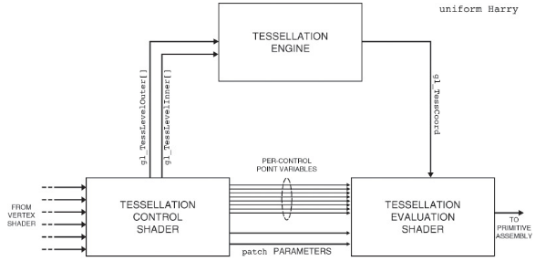
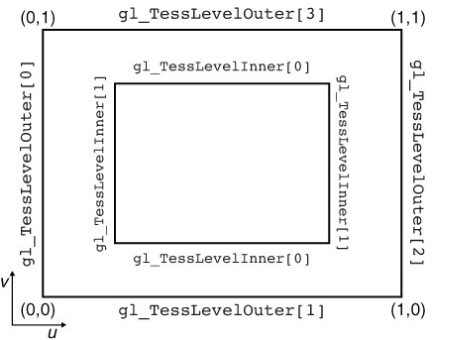
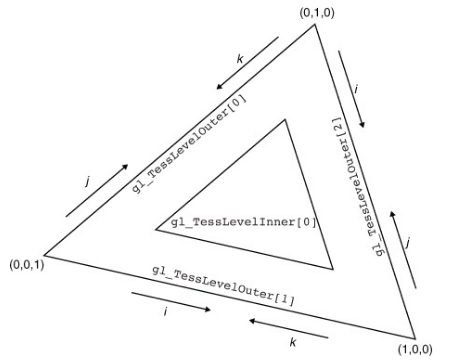
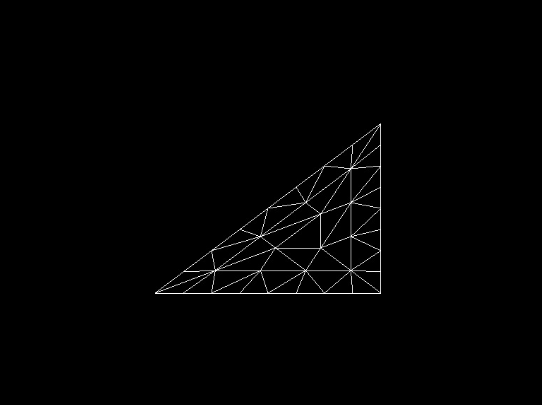
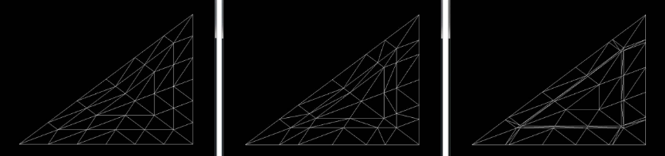
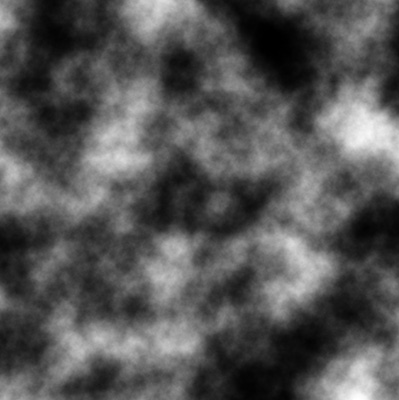

# Tessellation

The next few stages of the pipeline seem similar to vertex shaders at first, but can actually be considered primitive processing stages. First, the two tessellation shader stages and the fixed-function tessellator that they flank together process patches. Next, the geometry shader processes entire primitives (points, lines, and triangles) and runs once for each. In this lesson, we’ll cover both tessellation and geometry shading, and investigate some of the OpenGL features that they unlock.

Tessellation is the process of breaking a large primitive referred to as a patch into many smaller primitives before rendering them.

There are many uses for tessellation, but the most common application is to add geometric detail to otherwise lower-fidelity meshes. In OpenGL, tessellation is produced using three distinct stages of the pipeline—the tessellation control shader (TCS), the fixed-function tessellation engine, and the tessellation evaluation shader (TES). Logically, these three stages fit between the vertex shader and the geometry shader stages. When tessellation is active, incoming vertex data is first processed in the usual way by the vertex shader and then passed, in groups, to the tessellation control shader.

The tessellation control shader operates on groups of up to 32 vertices at a time, where the group is collectively known as a patch. In the context of tessellation, the input vertices are often referred to as control points. The tessellation control shader is responsible for generating three things:

The minimum number of vertices per patch required to be supported by the OpenGL spec-ification is 32. However, the upper limit is not fixed and may be determined by retrieving the value of GL_MAX_PATCH_VERTICES.

• The per-patch inner and outer tessellation factors

• The position and other attributes for each output control point

• Per-patch user-defined varyings

The tessellation factors are sent on to the fixed-function tessellation engine, which uses them to determine the way that it will break up the patch into smaller primitives. Besides the tessellation factors, the output of a tessellation control shader is a new patch (i.e., a new collection of vertices) that is passed to the tessellation evaluation shader after the patch has been tessellated by the tessellation engine. If some of the data is common to all output vertices (such as the color of the patch), then that data may be marked as per patch.

When the fixed-function tessellator runs, it generates a new set of vertices spaced across the patch as determined by the tessellation factors and the tessellation mode, which is set using a layout declaration in the tessellation evaluation shader. The only input to the tessellation evaluation shader generated by OpenGL is a set of coordinates indicating where in the patch the vertex lies. When the tessellator is generating triangles, those coordinates are barycentric coordinates. When the tessellation engine is generating lines or triangles, those coordinates are simply a pair of normalized values indicating the relative position of the vertex. This data is stored in the gl_TessCoord input variable. The schematic in figure shows the setup.



## Tessellation Primitive Modes

The tessellation mode is used to determine how OpenGL breaks up patches into primitives before passing them on to rasterization. This mode is set using an input layout qualifier in the tessellation evaluation shader and may be one of quads, triangles, or isolines. This primitive mode controls not only the form of the primitives produced by the tessellator, but also the interpretation of the gl_TessCoord input variable in the tessellation evaluation shader.

### Tessellation Using Quads

When the chosen tessellation mode is set to quads, the tessellation engine will generate a quadrilateral (or quad) and break it up into a set of triangles. The two elements of the gl_TessLevelInner[] array should be written by the tessellation control shader and control the level of tessellation applied to the innermost region within the quad. The first element sets the tessellation applied in the horizontal (u) direction and the second element sets the tessellation level applied in the vertical (v) direction. Also, all four elements of the gl_TessLevelOuter[] array should be written by the tessellation control shader and are used to determine the level of tessellation applied to the outer edges of the quad. This is shown in figure.



When the quad is tessellated, the tessellation engine generates vertices across a two-dimensional domain normalized within the quad. The value stored in the gl_TessCoord input variable sent to the tessellation evaluation shader is then a two-dimensional vector (that is, only the x and y components of gl_TessCoord are valid) containing the normalized coordinates of the vertex within the quad. The tessellation evaluation shader can use these coordinates to generate its outputs from the inputs passed by the tessellation control shader. An example of quad tessellation produced by the Scene_015_TessellationModes sample application.

`015_TessellationModes.vert`
```
#version 450 core

void main(void)
{
    const vec4 vertices[] = vec4[](vec4( 0.4, -0.4, 0.5, 1.0),
                                   vec4(-0.4, -0.4, 0.5, 1.0),
                                   vec4( 0.4,  0.4, 0.5, 1.0),
                                   vec4(-0.4,  0.4, 0.5, 1.0));

    gl_Position = vertices[gl_VertexID];
}
```

`015_TessellationModes.tesc`
```
#version 450 core

layout (vertices = 4) out;

void main(void)
{
    if (gl_InvocationID == 0)
    {
        gl_TessLevelInner[0] = 9.0;
        gl_TessLevelInner[1] = 7.0;
        gl_TessLevelOuter[0] = 3.0;
        gl_TessLevelOuter[1] = 5.0;
        gl_TessLevelOuter[2] = 3.0;
        gl_TessLevelOuter[3] = 5.0;
    }
    gl_out[gl_InvocationID].gl_Position = gl_in[gl_InvocationID].gl_Position;
}
```

`015_TessellationModes.tese`
```
#version 450 core

layout (quads) in;

void main(void)
{
    vec4 p1 = mix(gl_in[0].gl_Position, gl_in[1].gl_Position, gl_TessCoord.x);
    vec4 p2 = mix(gl_in[2].gl_Position, gl_in[3].gl_Position, gl_TessCoord.x);
    gl_Position = mix(p1, p2, gl_TessCoord.y);
}
```


`015_TessellationModes.frag`
```
#version 450 core

out vec4 color;

void main(void)
{
    color = vec4(1.0);
}
```

`Scene_015_TessellationModes.cpp`
```
...
void Scene_015_TessellationModes::load() {
    Assets::loadShader(SHADER_VERT(SHADER_NAME), SHADER_FRAG(SHADER_NAME), SHADER_TECS(SHADER_NAME), SHADER_TESE(SHADER_NAME), "", SHADER_ID(SHADER_NAME));

    glGenVertexArrays(1, &vao);
    glBindVertexArray(vao);

    glPatchParameteri(GL_PATCH_VERTICES, 4);
    glPolygonMode(GL_FRONT_AND_BACK, GL_LINE);

    shader = Assets::getShader(SHADER_ID(SHADER_NAME));
}

void Scene_015_TessellationModes::update(float dt) {

}

void Scene_015_TessellationModes::draw()
{
    static const GLfloat bgColor[] = {0.0f, 0.0f, 0.2f, 1.0f};
    glClearBufferfv(GL_COLOR, 0, bgColor);

    shader.use();
    glPolygonMode(GL_FRONT_AND_BACK, GL_LINE);
    glDrawArrays(GL_PATCHES, 0, 4);
    glPolygonMode(GL_FRONT_AND_BACK, GL_FILL);
}
...
```

In this program, the inner tessellation factors in the u and v directions were set to 9.0 and 7.0, respectively. The outer tessellation factors were set to 3.0 and 5.0, respectively, in the u and v directions.

The result of setting the tessellation factors in this way is visible in the output image. If you look closely, you will see that along the horizontal outer edges there are five divisions and along the vertical ones there are three divisions. On the interior, you can see that there are nine divisions along the horizontal axis and seven divisions along the vertical axis.

Notice that the tessellation mode in the tessellation evaluation shader is set using the quads input layout qualifier near the front of the tessellation evaluation shader. The shader then uses the x and y components of gl_TessCoordinate to perform its own interpolation of the vertex position. In this case, the gl_in[] array is four elements long (as specified in the control shader).

### Tessellation Using Triangles

When the tessellation mode is set to triangles (again, using an input layout qualifier in the tessellation control shader), the tessellation engine produces a triangle that is then broken into many smaller triangles. Only the first element of the gl_TessLevelInner[] array is used, and this level is applied to the entirety of the inner area of the tessellated triangle. The first three elements of the gl_TessLevelOuter[] array are used to set the tessellation factors for the three edges of the triangle.



As the tessellation engine generates the vertices corresponding to the tessellated triangles, each vertex is assigned a three-dimensional coordinate called a barycentric coordinate. The three components of a barycentric coordinate can be used to form a weighted sum of three inputs representing the corners of a triangle and to arrive at a value that is linearly interpolated across that triangle. An example of triangle tessellation :



`015_TessellationModes.tesc`
```
#version 450 core

layout (vertices = 3) out;

void main(void)
{
    if (gl_InvocationID == 0)
    {
        gl_TessLevelInner[0] = 5.0;
        gl_TessLevelOuter[0] = 8.0;
        gl_TessLevelOuter[1] = 8.0;
        gl_TessLevelOuter[2] = 8.0;
    }
    gl_out[gl_InvocationID].gl_Position = gl_in[gl_InvocationID].gl_Position;
}
```

Notice how similar it is to the quad example, in that all it does is write constants into the inner and outer tessellation levels and pass through the control point positions unmodified. The code lets the inner tessellation level to 5.0 and all three outer tessellation levels to 8.0. Again, looking closely at image output, you can see that each of the outer edges of the tessellated triangle has eight divisions and each of the inner edges has five divisions.

`015_TessellationModes.tese`
```
#version 450 core

layout (triangles) in;
// layout (triangles, equal_spacing, cw) in;

void main(void)
{
    gl_Position =   (gl_TessCoord.x * gl_in[0].gl_Position) +
                    (gl_TessCoord.y * gl_in[1].gl_Position) +
                    (gl_TessCoord.z * gl_in[2].gl_Position);
}
```

Again, to produce a position for each vertex generated by the tessellation engine, we simply calculate a weighted sum of the input vertices. This time, all three components of gl_TessCoord are used and represent the relative weights of the three vertices making up the outermost tessellated triangle. Of course, we’re free to do anything we wish with the barycentric coordinates, the inputs from the tessellation control shader, and any other data we have access to in the evaluation shader.

### Other modes

Other modes exist, such as isolines and points.

## Tesselation subdivision modes

### Controlling subdivision

The tessellation engine works by generating a triangle or quad primitive and then subdividing its edges into a number of segments determined by the inner and outer tessellation factors produced by the tessellation control shader. Next, it groups the generated vertices into points, lines, or triangles and sends them on for further processing. In addition to specifying the type of primitives generated by the tessellation engine, you have quite a bit of control over how the engine subdivides the edges of the generated primitives.

By default, the tessellation engine will subdivide each edge into a number of equal-sized parts where the number of parts is set by the corresponding tessellation factor. This is known as equal_spacing mode. Although it is the default, it can be made explicit by including the following layout qualifier in your tessellation evaluation shader:

```
layout (equal_spacing) in;
```

Equal spacing mode is perhaps the easiest mode to comprehend: simply set the tessellation factor to the number of segments you wish to subdivide your patch primitive into along each edge, and the tessellation engine takes care of the rest. Although it may seem simple, the equal_spacing mode comes with a significant disadvantage: When you alter the tessellation factor, it is always rounded to up to the next nearest integer, producing a visible jump from one level to the next as the tessellation factor changes. The two other modes, fractional_even_spacing and fractional_odd_spacing, alleviate this problem by allowing the segments to be non-equal in length. These modes are fractional_even_spacing and fractional_odd_spacing and again, you can set these modes by using input layout qualifiers as follows:

```
layout (fractional_even_spacing) in;
// or
layout (fractional_odd_spacing) in;
```

With fractional even spacing, the tessellation factor is rounded to the next-lower even integer and the edge is subdivided as if that were the tessellation factor. With fractional odd spacing, the tessellation factor is rounded down to the next-lower odd number and the edge is subdivided as if that were the tessellation factor. Of course, with either scheme, there is a small remaining segment that doesn’t have the same length as the other segments. That last segment is cut in half, with each half having the same length as the other and therefore being a fractional segment.

Next figure shows the same triangle tessellated with equal_spacing mode on the left, fractional_even_spacing mode in the center, and fractional_odd_spacing mode on the right. In all three images shown, the inner and outer tessellation factors have been set to 5.3.



In the leftmost image showing equal_spacing mode, you should be able to see that the number of segments along each of the outer edges of the triangle is 6—the next integer after 5.3. In the center image, which shows fractional_even_spacing mode, there are 4 equal-sized segments (4 is the next lower even integer to 5.3) and then two additional smaller segments. Finally, in the rightmost image, which demonstrates fractional_odd_spacing mode, there are 5 equal-sized segments (5 is the next lower odd integer to 5.3) and two very skinny segments that make up the rest.

If the tessellation level is animated, either by being explicitly turned up and down using a uniform or by being calculated in the tessellation control shader, the lengths of the equal-sized segments and the two filler segments will change smoothly and dynamically. Whether you choose fractional_even_spacing or fractional_odd_spacing really depends on which looks better in your application—there is generally no real advantage to either. However, unless you need a guarantee that tessellated edges will have equal-sized segments, and if you can live with popping when the tessellation level changes, fractional_even_spacing or fractional_odd_spacing will generally look better in any dynamic application than equal_spacing.

### Controlling the winding order


In a previous lesson, we introduced culling and explained how the winding order of a primitive affects how OpenGL decides whether to render it. Normally, the winding order of a primitive is determined by the order in which your application presents vertices to OpenGL. However, when tessellation is active, OpenGL generates all the vertices and connectivity information for you. To allow you to control the winding order of the resulting primitives, you can specify whether you want the vertices to be generated in clockwise or counterclockwise order. Again, this is set using an input layout qualifier in the tessellation evaluation shader. To indicate that you want clockwise winding order, use the following layout qualifier:
```
layout (cw) in;
```
To specify that the winding order of the primitives generated by the tessellation engine be counterclockwise, include this qualifier:
```
layout (ccw) in;
```
The cw and ccw layout qualifiers can be combined with the other input layout qualifiers specified in the tessellation control shader. By default, the winding order is counterclockwise, so you can omit this layout qualifier if that is what you need. Also, it should be self-evident that winding order applies only to triangles. If your application generates isolines or points, then the winding order is ignored—your shader can still include the winding order layout qualifier, but it won’t be used.

## Passing Data between Tessellation Shaders

In this lesson, we have looked at how to set the inner and outer tessellation levels for the quad, triangle, and point primitive modes. However, the output images aren’t particularly exciting, in part because we haven’t done anything except compute the positions of the resulting vertices and shade the resulting primitives solid white. In fact, we have rendered all of these images using lines by setting the polygon mode to GL_LINE with the glPolygonMode() function. To produce something a little more interesting, we need to pass more data along the pipeline.

Before a tessellation control shader is run, each vertex represents a control point; the vertex shader runs once for each input control point and produces its output as normal. The vertices (or control points) are then grouped together and passed together to the tessellation control shader. The tessellation control shader processes this group of control points and produces a new group of control points that may or may not have the same number of elements in it as the original group. The tessellation control shader actually runs once for each control point in the output group, but each invocation of the tessellation control shader has access to all of the input control points. For this reason, both the inputs to and outputs from a tessellation control shader are represented as arrays. The input arrays are sized by the number of control points in each patch, which is set by calling
```
glPatchParameteri(GL_PATCH_VERTICES, n);
```
Here, n is the number of vertices per patch. By default, the number of vertices per patch is 3. The size of the input arrays in the tessellation control shader is set by this parameter and their contents come from the vertex shader. The built-in variable gl_in[] is always available and is declared as an array of the gl_PerVertex structure. This structure is where the built-in outputs go after you write to them in your vertex shader. All other outputs from the vertex shader become arrays in the tessellation control shader as well. In particular, if you use an output block in your vertex shader, the instance of that block becomes an array of instances in the tessellation control shader. So, for example,

```
out VS_OUT
{
    vec4      foo;
    vec3      bar;
    int       baz
} vs_out;
```
becomes

```
in VS_OUT
{
    vec4      foo;
    vec3      bar;
    int       baz;
} tcs_in[];
```
in the tessellation evaluation shader.

The output of the tessellation control shader is also an array, but its size is set by the vertices output layout qualifier at the front of the shader. It is quite common to set the input and output vertex count to the same value (as was the case in the examples earlier in this section) and then pass the input directly to the output from the tessellation control shader. However, there’s no requirement to use this approach, and the size of the output arrays in the tessellation control shader is limited by the value of the GL_MAX_PATCH_VERTICES constant.

The outputs of the tessellation control shader are arrays, so the inputs to the tessellation evaluation shader are also similarly sized arrays. The tessellation evaluation shader runs once per generated vertex and, like the tessellation control shader, has access to all of the data for all of the vertices in the patch.

In addition to the per-vertex data passed from the tessellation control shader to the tessellation evaluation shader in arrays, you can pass data directly between the stages that is constant across an entire patch. To do this, simply declare the output variable in the tessellation control shader and the corresponding input in the tessellation evaluation shader using the patch keyword. In this case the variable does not have to be declared as an array (although you are welcome to use arrays as patch qualified variables) because there is only one instance per patch.

### Rendering without a Tessellation Control Shader

The purpose of the tessellation control shader is to perform tasks such as computing the value of per-patch inputs to the tessellation evaluation shader and to calculate the values of the inner and outer tessellation levels that will be used by the fixed-function tessellator. However, in some simple applications, there are no per-patch inputs to the tessellation evaluation shader and the tessellation control shader simply writes constants to the tessellation levels. In this case, it’s possible to set up a program with a tessellation evaluation shader, but without a tessellation control shader.

When no tessellation control shader is present, the default value for all inner and outer tessellation levels is 1.0. You can change this by calling glPatchParameterfv(), whose prototype is

```
void glPatchParameterfv(GLenum pname, const GLfloat * values);
```

If pname is GL_PATCH_DEFAULT_INNER_LEVEL, then values should point to an array of two floating-point values that will be used as the new default inner tessellation levels in the absence of a tessellation control shader. Likewise, if pname is GL_PATCH_DEFAULT_OUTER_LEVEL, then values should point to an array of four floating-point values that will be used as the new default outer tessellation levels.

If no tessellation control shader is part of the current pipeline, then the number of control points that is presented to the tessellation evaluation shader is the same as the number of control points per patch set by `glPatchParameteri()` when the `pname` parameter is set to GL_PATCH_VERTICES. In this case, the input to the tessellation evaluation shader comes directly from the vertex shader. That is, the input to the tessellation evaluation shader is an array formed from the outputs of the vertex shader invocations that generated the patch.

## Communication between Shader Invocations

While the primary purpose of output variables in tessellation control shaders is to pass data to the tessellation evaluation shader, they also have a secondary purpose—namely, to communicate data between control shader invocations. As you have read, the tessellation control shader runs a single invocation for each output control point in a patch. Each output variable in the tessellation control shader is therefore an array, the length of which is the number of control points in the output patch. Normally, each tessellation control shader invocation will take responsibility for writing to one element of this array.

What might not be obious is that tessellation control shaders can actually read from their output variables—including those that might be written by other invocations! The tessellation control shader is designed in such a way that the invocations can run in parallel. However, there is no ordering guarantee that governs how those shaders actually execute your code. Thus, when you read from another invocation’s output variable, you cannot tell whether that invocation has actually written data there.

To deal with this lack of visibility, GLSL includes the barrier() function. It is known as a flow-control barrier, because it dictates the relative order of execution of multiple shader invocations. The barrier() function really shines when used in compute shaders—we’ll get to that later. However, it’s available in a limited form in tessellation control shaders, as well, albeit with a number of restrictions. In particular, in a tessellation control shader, barrier() may only be called directly from within your main() function and can’t be inside any control flow structures (such as if, else, while, or switch).

When you call barrier(), the tessellation control shader invocation stops and waits for all the other invocations in the same patch to catch up. Its execution doesn’t resume until all the other invocations have reached the same point. As a consequence, if you write to an output variable in a tessellation control shader and then call barrier(), you can be sure that all the other invocations have done the same thing by the time barrier() returns, meaning it’s safe to read from the other invocations’ output variables.

## Tessellation example : terrain rendering

To demonstrate a potential use for tessellation, we will cover a simple terrain rendering system based on quadrilateral patches and displacement mapping.

The code for this example is part of the scene 016. A displacement map is a texture that contains the displacement from a surface at each location. Each patch represents a small region of a landscape that is tessellated depending on its likely screen-space area. Each tessellated vertex is moved along the tangent to the surface by the value stored in the displacement map. This adds geometric detail to the surface without needing to explicitly store the position of each tessellated vertex. Rather, only the displacements from an otherwise flat landscape are stored in the displacement map and are applied at runtime in the tessellation evaluation shader. The displacement map (which is also known as a height map) used in the example is shown in Figure:



Our first step is to set up a simple vertex shader. As each patch is effectively a simple quad, we can use a constant in the shader to represent the four vertices rather than setting up vertex arrays for it.

`016_TerrainRendering.vert`
```
#version 450 core

out VS_OUT
{
    vec2 tc;
} vs_out;

void main(void)
{
    const vec4 vertices[] = vec4[](vec4(-0.5, 0.0, -0.5, 1.0),
                                   vec4( 0.5, 0.0, -0.5, 1.0),
                                   vec4(-0.5, 0.0,  0.5, 1.0),
                                   vec4( 0.5, 0.0,  0.5, 1.0));

    int x = gl_InstanceID & 63;
    int y = gl_InstanceID >> 6;
    vec2 offs = vec2(x, y);

    vs_out.tc = (vertices[gl_VertexID].xz + offs + vec2(0.5)) / 64.0;
    gl_Position = vertices[gl_VertexID] + vec4(float(x - 32), 0.0,
                                               float(y - 32), 0.0);
}

```

The shader uses the instance number (stored in gl_InstanceID) to calculate an offset for the patch, which is a one-unit square in the x–z plane, centered on the origin. In this application, we will render a grid of 64 × 64 patches, so the x and y offsets for the patch are calculated by taking gl_InstanceID modulo 64 and gl_InstanceID divided by 64. The vertex shader also calculates the texture coordinates for the patch, which are passed to the tessellation control shader in `vs_out.tc`.

Next, we come to the tessellation control shader.

`016_TerrainRendering.tesc`
```
#version 450 core

layout (vertices = 4) out;

in VS_OUT
{
    vec2 tc;
} tcs_in[];

out TCS_OUT
{
    vec2 tc;
} tcs_out[];

uniform mat4 mvp_matrix;

void main(void)
{
    if (gl_InvocationID == 0)
    {
        vec4 p0 = mvp_matrix * gl_in[0].gl_Position;
        vec4 p1 = mvp_matrix * gl_in[1].gl_Position;
        vec4 p2 = mvp_matrix * gl_in[2].gl_Position;
        vec4 p3 = mvp_matrix * gl_in[3].gl_Position;
        p0 /= p0.w;
        p1 /= p1.w;
        p2 /= p2.w;
        p3 /= p3.w;
        if (p0.z <= 0.0 ||
            p1.z <= 0.0 ||
            p2.z <= 0.0 ||
            p3.z <= 0.0)
         {
              gl_TessLevelOuter[0] = 0.0;
              gl_TessLevelOuter[1] = 0.0;
              gl_TessLevelOuter[2] = 0.0;
              gl_TessLevelOuter[3] = 0.0;
         }
         else
         {
            float l0 = length(p2.xy - p0.xy) * 16.0 + 1.0;
            float l1 = length(p3.xy - p2.xy) * 16.0 + 1.0;
            float l2 = length(p3.xy - p1.xy) * 16.0 + 1.0;
            float l3 = length(p1.xy - p0.xy) * 16.0 + 1.0;
            gl_TessLevelOuter[0] = l0;
            gl_TessLevelOuter[1] = l1;
            gl_TessLevelOuter[2] = l2;
            gl_TessLevelOuter[3] = l3;
            gl_TessLevelInner[0] = min(l1, l3);
            gl_TessLevelInner[1] = min(l0, l2);
        }
    }
    gl_out[gl_InvocationID].gl_Position = gl_in[gl_InvocationID].gl_Position;
    tcs_out[gl_InvocationID].tc = tcs_in[gl_InvocationID].tc;
}

```
In this example, the bulk of the rendering algorithm is implemented in the tessellation control shader, and the majority of the code is executed only by the first invocation. Once we have determined that we are the first invocation by checking that gl_InvocationID is zero, we calculate the tessellation levels for the whole patch.

First, we project the corners of the patch into normalized device coordinates by multiplying the incoming coordinates by the model–view-projection matrix and then dividing each of the four points by its own homogeneous .w component.

Next, we calculate the length of each of the four edges of the patch in normalized device space after projecting them onto the x–y plane by ignoring their z components. Then, the shader calculates the tessellation level of each edge of the patch as a function of its length using a simple scale and bias. Finally, the inner tessellation factors are simply set to the minimum of the outer tessellation factors calculated from the edge lengths in the horizontal or vertical directions.

You may have noticed a piece of code that checks whether all of the z coordinates of the projected control points are less than zero and then sets the outer tessellation levels to zero in such a case. This optimization culls entire patches that are behind the viewer.

Once the tessellation control shader has calculated the tessellation levels for the patch, it simply copies its input to its output. It does this per instance and passes the resulting data to the tessellation evaluation shader.

`016_TerrainRendering.tese`
```
#version 450 core

layout (quads, fractional_odd_spacing) in;

layout (binding = 1) uniform sampler2D tex_displacement;

uniform mat4 mv_matrix;
uniform mat4 proj_matrix;
uniform mat4 mvp_matrix;
uniform float dmap_depth;

in TCS_OUT
{
    vec2 tc;
} tes_in[];

out TES_OUT
{
    vec2 tc;

/*

    // Optional, for fog
    vec3 world_coord;
    vec3 eye_coord;

*/

} tes_out;

void main(void)
{
    vec2 tc1 = mix(tes_in[0].tc, tes_in[1].tc, gl_TessCoord.x);
    vec2 tc2 = mix(tes_in[2].tc, tes_in[3].tc, gl_TessCoord.x);
    vec2 tc = mix(tc2, tc1, gl_TessCoord.y);

    vec4 p1 = mix(gl_in[0].gl_Position, gl_in[1].gl_Position, gl_TessCoord.x);
    vec4 p2 = mix(gl_in[2].gl_Position, gl_in[3].gl_Position, gl_TessCoord.x);
    vec4 p = mix(p2, p1, gl_TessCoord.y);
    p.y += texture(tex_displacement, tc).r * dmap_depth;

    gl_Position = mvp_matrix * p;
    tes_out.tc = tc;
/*

    // Optional, instead of the two previous lines:
    // Compute eye position for fog
    vec4 P_eye = mv_matrix * p;

    tes_out.tc = tc;
    tes_out.world_coord = p.xyz;
    tes_out.eye_coord = P_eye.xyz;

    gl_Position = proj_matrix * P_eye;

*/
}
```

The tessellation evaluation shader first calculates the texture coordinate of the generated vertex by linearly interpolating the texture coordinates passed from the tessellation control shader (which were in turn generated by the vertex shader). Next, it applies a similar interpolation to the incoming control point positions to produce the position of the outgoing vertex. However, it then uses the texture coordinate that it calculated to offset the vertex in the y direction before multiplying that result by the model–view-projection matrix (the same one that was used in the tessellation control shader). It also passes the computed texture coordinate to the fragment shader in tes_out.tc.

`016_TerrainRendering.frag`
```
#version 450 core

out vec4 color;

layout (binding = 2) uniform sampler2D tex_color;

in TES_OUT
{
    vec2 tc;
} fs_in;


void main(void)
{
    color = texture(tex_color, fs_in.tc);
}
```

The fragment shader shown in Listing 8.11 is really quite simple. All it does is use the texture coordinate that the tessellation evaluation shader gave it to look up a color for the fragment.

The scene code is here:
`Scene_016_TerrainRendering.h`
```
...
private:
    Game *game;
    GLuint vao;
    GLuint buffer;

    // Uniforms
    Matrix4 mvp;
    Matrix4 view;
    Matrix4 proj;
    float dmapDepth;
    bool isFogEnabled;

    GLuint texDisplacement;
    GLuint texColor;
    bool isDisplacementEnabled;
    bool wireframe;
    bool paused;

    float totalTime;
    float t, r, h;

    Shader shader;
...
```

`Scene_016_TerrainRendering.cpp`
```
...
Scene_016_TerrainRendering::Scene_016_TerrainRendering():
    dmapDepth(8.0f), isFogEnabled(true), isDisplacementEnabled(true),
    wireframe(false), paused(false), totalTime(0)
{
}

...

void Scene_016_TerrainRendering::handleEvent(const InputState &inputState) {
    if(inputState.keyboardState.isDown(SDL_SCANCODE_Q)) {
        dmapDepth += 0.1f;
    }
    if(inputState.keyboardState.isDown(SDL_SCANCODE_E)) {
        dmapDepth -= 0.1f;
    }
    if(inputState.keyboardState.isJustPressed(SDL_SCANCODE_D)) {
        isDisplacementEnabled = !isDisplacementEnabled;
    }
    if(inputState.keyboardState.isJustPressed(SDL_SCANCODE_F)) {
        isFogEnabled = !isFogEnabled;
    }
    if(inputState.keyboardState.isJustPressed(SDL_SCANCODE_W)) {
        wireframe = !wireframe;
    }
    if(inputState.keyboardState.isJustPressed(SDL_SCANCODE_P)) {
        paused = !paused;
    }
}

void Scene_016_TerrainRendering::load() {
    Assets::loadShader(SHADER_VERT(SHADER_NAME), SHADER_FRAG(SHADER_NAME), SHADER_TECS(SHADER_NAME), SHADER_TESE(SHADER_NAME), "", SHADER_ID(SHADER_NAME));

    glGenVertexArrays(1, &vao);
    glBindVertexArray(vao);

    glPatchParameteri(GL_PATCH_VERTICES, 4);

    glEnable(GL_CULL_FACE);

    glActiveTexture(GL_TEXTURE1);
    Assets::loadTextureKtx("assets/textures/terragen1.ktx", "terragen1");
    texDisplacement = Assets::getTextureKtx("terragen1").id;
    glBindTexture(GL_TEXTURE_2D, texDisplacement);

    glActiveTexture(GL_TEXTURE2);
    Assets::loadTextureKtx("assets/textures/terragen_color.ktx", "terragen_color");
    texColor = Assets::getTextureKtx("terragen_color").id;
    glBindTexture(GL_TEXTURE_2D, texColor);

    shader = Assets::getShader(SHADER_ID(SHADER_NAME));
}

void Scene_016_TerrainRendering::update(float dt) {
    if (!paused)
        totalTime += dt;

    t = totalTime * 0.03f;
    r = sinf(t * 5.37f) * 15.0f + 16.0f;
    h = cosf(t * 4.79f) * 2.0f + 10.2f;
}

void Scene_016_TerrainRendering::draw()
{
    static const GLfloat bgColor[] = {0.0f, 0.0f, 0.2f, 1.0f};
    static const GLfloat one = 1.0f;
    glClearBufferfv(GL_COLOR, 0, bgColor);
    glClearBufferfv(GL_DEPTH, 0, &one);

    view = Matrix4::createLookAt(Vector3(sinf(t) * r, h, cosf(t) * r), Vector3::zero, Vector3(0.0f, 1.0f, 0.0f));
    proj = Matrix4::createPerspectiveFOV(45.0f, game->windowWidth, game->windowHeight, 0.1f, 1000.0f);

    shader.use();
    shader.setMatrix4("mv_matrix", view);
    shader.setMatrix4("proj_matrix", proj);
    shader.setMatrix4("mvp_matrix", proj * view);
    shader.setFloat("dmap_depth", isDisplacementEnabled ? dmapDepth : 0.0f);
    shader.setFloat("enable_fog", isFogEnabled ? 1.0f : 0.0f);

    glEnable(GL_DEPTH_TEST);
    glDepthFunc(GL_LEQUAL);

    if (wireframe)
        glPolygonMode(GL_FRONT_AND_BACK, GL_LINE);
    else
        glPolygonMode(GL_FRONT_AND_BACK, GL_FILL);
    glDrawArraysInstanced(GL_PATCHES, 0, 4, 64 * 64);
}

```

If we’ve done our job correctly, you shouldn’t be able to tell that the underlying geometry is tessellated. However, if you press Z (or W on a QWERTY keyboard), you can clearly see the underlying triangular mesh of the landscape. The goals of the program are that all of the triangles rendered on the screen have roughly similar screen-space area and that sharp transitions in the level of tessellation are not visible in the rendered image.

Note that if you want to use the optional fog, you need to update the fragment shader, and uncomment the appropriated part of the tessellation evaluation shader:

`016_TerrainRendering.frag`
```
#version 450 core

out vec4 color;

layout (binding = 2) uniform sampler2D tex_color;

uniform bool enable_fog = true;
uniform vec4 fog_color = vec4(0.7, 0.8, 0.9, 0.0);

in TES_OUT
{
    vec2 tc;
    // Optional, for fog
    vec3 world_coord;
    vec3 eye_coord;
} fs_in;

vec4 fog(vec4 c)
{
    float z = length(fs_in.eye_coord);

    float de = 0.025 * smoothstep(0.0, 6.0, 10.0 - fs_in.world_coord.y);
    float di = 0.045 * (smoothstep(0.0, 40.0, 20.0 - fs_in.world_coord.y));

    float extinction   = exp(-z * de);
    float inscattering = exp(-z * di);

    return c * extinction + fog_color * (1.0 - inscattering);
}

void main(void)
{
    vec4 landscape = texture(tex_color, fs_in.tc);
    if (enable_fog){
        color = fog(landscape);
    } else {
        color = landscape;
    }
}
```

## Tessellation example : cubic Bezier patches

In the displacement mapping example, all we did was use a texture to drive displacement from a flat surface and then use tessellation to increase the number of polygons in the scene. This is a type of brute-force, data-driven approach to geometric complexity. In the cubicbezier example described here, we will use math to drive geometry — we’re going to render a cubic Bézier patch.

A cubic Bézier patch is a type of higher-order surface and is defined by control points that provide input to the interpolation functions that define the surface’s shape. A Bézier patch has 16 control points, laid out in a 4 × 4 grid. Very often (including in this example), those control points are equally spaced in two dimensions, varying only in distance from a shared plane. However, they don’t have to be. Free-form Bézier patches are an extremely powerful modeling tool being used natively by many pieces of modeling and design software. With OpenGL tessellation, it’s possible to render them directly.

The simplest method of rendering a Bézier patch is to treat the four control points in each row of the patch as the control points for a single cubic Bézier curve. Given our 4 × 4 grid of control points, we have four curves; if we interpolate along each of them using the same value of t, we will end up with four new points. We use these four points as the control points for a second cubic Bézier curve. Interpolating along this second curve using a new value for t gives us a second point that lies on the patch. The two values of t (let’s call them t0 and t1) are the domain of the patch and are handed to us by the tessellation evaluation shader in gl_TessCoord.xy.

In this example, we’ll perform tessellation in view space. That is, in our vertex shader, we’ll transform our patch’s control points into view space by multiplying their coordinates by the model–view matrix. Here is the vertex shader:

`017_CubicBezierPatches.vert`
```
#version 450 core

in vec4 position;
uniform mat4 mv_matrix;

void main(void)
{
    gl_Position = mv_matrix * position;
}
```

Once our control points are in view space, they are passed to our tessellation control shader. In a more advanced algorithm, we could project the control points into screen space, determine the length of the curve, and set the tessellation factors appropriately. However, in this example, we’ll settle for a simple fixed tessellation factor. As in previous examples, we set the tessellation factor only when gl_InvocationID is zero, but pass all of the other data through once per invocation.


`017_CubicBezierPatches.tesc`
```
#version 450 core

layout (vertices = 16) out;

void main(void)
{
    uint id = gl_InvocationID;

    if (id == 0)
    {
        gl_TessLevelInner[0] = 16.0;
        gl_TessLevelInner[1] = 16.0;
        gl_TessLevelOuter[0] = 16.0;
        gl_TessLevelOuter[1] = 16.0;
        gl_TessLevelOuter[2] = 16.0;
        gl_TessLevelOuter[3] = 16.0;
    }

    gl_out[gl_InvocationID].gl_Position = gl_in[id].gl_Position;
}
```

Next, we come to the tessellation evaluation shader, which is where the meat of the algorithm is found. The evaluate_patch function is responsible for evaluating the vertex’s coordinate given the input patch coordinates and the vertex’s position within the patch.

`017_CubicBezierPatches.tese`
```
#version 450 core

layout (quads, equal_spacing, cw) in;

uniform mat4 mv_matrix;
uniform mat4 proj_matrix;
uniform mat4 mvp;

out TES_OUT
{
    vec3 N;
} tes_out;

vec4 quadratic_bezier(vec4 A, vec4 B, vec4 C, float t)
{
    vec4 D = mix(A, B, t);
    vec4 E = mix(B, C, t);

    return mix(D, E, t);
}

vec4 cubic_bezier(vec4 A, vec4 B, vec4 C, vec4 D, float t)
{
    vec4 E = mix(A, B, t);
    vec4 F = mix(B, C, t);
    vec4 G = mix(C, D, t);

    return quadratic_bezier(E, F, G, t);
}

vec4 evaluate_patch(vec2 at)
{
    vec4 P[4];
    int i;

    for (i = 0; i < 4; i++)
    {
        P[i] = cubic_bezier(gl_in[i + 0].gl_Position,
                            gl_in[i + 4].gl_Position,
                            gl_in[i + 8].gl_Position,
                            gl_in[i + 12].gl_Position,
                            at.y);
    }

    return cubic_bezier(P[0], P[1], P[2], P[3], at.x);
}

const float epsilon = 0.001;

void main(void)
{
    vec4 p1 = evaluate_patch(gl_TessCoord.xy);
    vec4 p2 = evaluate_patch(gl_TessCoord.xy + vec2(0.0, epsilon));
    vec4 p3 = evaluate_patch(gl_TessCoord.xy + vec2(epsilon, 0.0));

    vec3 v1 = normalize(p2.xyz - p1.xyz);
    vec3 v2 = normalize(p3.xyz - p1.xyz);

    tes_out.N = cross(v1, v2);

    gl_Position = proj_matrix * p1;
}
```

In our tessellation evaluation shader, we calculate the surface normal to the patch by evaluating the patch position at two points very close to the point under consideration, using the additional points to calculate two vectors that lie on the patch and then taking their cross product. This result is passed to the fragment shader:

`017_CubicBezierPatches.frag`
```
#version 450 core

out vec4 color;

in TES_OUT
{
    vec3 N;
} fs_in;

void main(void)
{
    vec3 N = normalize(fs_in.N);

    vec4 c = vec4(1.0, -1.0, 0.0, 0.0) * N.z +
             vec4(0.0, 0.0, 0.0, 1.0);

    color = clamp(c, vec4(0.0), vec4(1.0));
}
```

This fragment shader performs a very simple lighting calculation using the z component of the surface normal.

In the scene code, we will automatically rotate the patches and move the control points of the bezier surface. We will add an additionnal shader to see the control points and the cage the bezier surface is bound in.

`Scene_017_CubicBezierPatches.h`
```
...
private:
    Game *game;
    GLuint vao;
    GLuint buffer;

    // Uniforms
    Matrix4 mvp;
    Matrix4 view;
    Matrix4 proj;
    GLuint cageIndices;
    Vector3 patchData[16];

    bool showPoints;
    bool showCage;
    bool wireframe;
    bool paused;

    float totalTime;
    float t;
    float rotationScale = 0.05f;
    float morphScale = 50.0f;

    Shader shader;
    Shader controlPointsShader;
...
```

`Scene_017_CubicBezierPatches.cpp`
```

void Scene_017_CubicBezierPatches::handleEvent(const InputState &inputState) {
    if(inputState.keyboardState.isJustPressed(SDL_SCANCODE_W)) {
        wireframe = !wireframe;
    }
    if(inputState.keyboardState.isJustPressed(SDL_SCANCODE_P)) {
        paused = !paused;
    }
    if(inputState.keyboardState.isJustPressed(SDL_SCANCODE_Q)) {
        showCage = !showCage;
    }
    if(inputState.keyboardState.isJustPressed(SDL_SCANCODE_E)) {
        showPoints = !showPoints;
    }
}

void Scene_017_CubicBezierPatches::load() {
    Assets::loadShader(SHADER_VERT(SHADER_NAME), SHADER_FRAG(SHADER_NAME), SHADER_TECS(SHADER_NAME), SHADER_TESE(SHADER_NAME), "", SHADER_ID(SHADER_NAME));
    Assets::loadShader("assets/shaders/017_ControlPoints.vert", "assets/shaders/017_ControlPoints.frag", "", "", "", "017_ControlPoints");

    glGenVertexArrays(1, &vao);
    glBindVertexArray(vao);

    glGenBuffers(1, &buffer);
    glBindBuffer(GL_ARRAY_BUFFER, buffer);

    glBufferData(GL_ARRAY_BUFFER, sizeof(patchData), NULL, GL_DYNAMIC_DRAW);
    glVertexAttribPointer(0, 3, GL_FLOAT, GL_FALSE, 0, NULL);
    glEnableVertexAttribArray(0);

    static const GLushort indices[] =
    {
        0, 1, 1, 2, 2, 3,
        4, 5, 5, 6, 6, 7,
        8, 9, 9, 10, 10, 11,
        12, 13, 13, 14, 14, 15,

        0, 4, 4, 8, 8, 12,
        1, 5, 5, 9, 9, 13,
        2, 6, 6, 10, 10, 14,
        3, 7, 7, 11, 11, 15
    };

    glGenBuffers(1, &cageIndices);
    glBindBuffer(GL_ELEMENT_ARRAY_BUFFER, cageIndices);
    glBufferData(GL_ELEMENT_ARRAY_BUFFER, sizeof(indices), indices, GL_STATIC_DRAW);

    shader = Assets::getShader(SHADER_ID(SHADER_NAME));
    controlPointsShader = Assets::getShader("017_ControlPoints");
}

void Scene_017_CubicBezierPatches::update(float dt) {
    if (!paused)
        totalTime += dt;

    t = totalTime * rotationScale;
}

void Scene_017_CubicBezierPatches::draw()
{
    // Bezier
    static const float patchInitializer[]
    {
        -1.0f,  -1.0f,  0.0f,
        -0.33f, -1.0f,  0.0f,
        0.33f, -1.0f,  0.0f,
        1.0f,  -1.0f,  0.0f,

        -1.0f,  -0.33f, 0.0f,
        -0.33f, -0.33f, 0.0f,
        0.33f, -0.33f, 0.0f,
        1.0f,  -0.33f, 0.0f,

        -1.0f,   0.33f, 0.0f,
        -0.33f,  0.33f, 0.0f,
        0.33f,  0.33f, 0.0f,
        1.0f,   0.33f, 0.0f,

        -1.0f,   1.0f,  0.0f,
        -0.33f,  1.0f,  0.0f,
        0.33f,  1.0f,  0.0f,
        1.0f,   1.0f,  0.0f,
    };

    static const GLfloat bgColor[] = {0.0f, 0.0f, 0.2f, 1.0f};
    static const GLfloat one = 1.0f;
    glClearBufferfv(GL_COLOR, 0, bgColor);
    glClearBufferfv(GL_DEPTH, 0, &one);

    glEnable(GL_DEPTH_TEST);

    Vector3* p = (Vector3 *)glMapBufferRange(GL_ARRAY_BUFFER, 0, sizeof(patchData), GL_MAP_WRITE_BIT | GL_MAP_INVALIDATE_BUFFER_BIT);
    memcpy(p, patchInitializer, sizeof(patchInitializer));

    int i;
    for (i = 0; i < 16; i++)
    {
        float fi = (float)i / 16.0f;
        p[i].z = sinf(t * morphScale * (0.2f + fi * 0.3f));
        patchData[i] = p[i];
    }

    glUnmapBuffer(GL_ARRAY_BUFFER);

    glBindVertexArray(vao);

    shader.use();

    proj = Matrix4::createPerspectiveFOV(45.0f, game->windowWidth, game->windowHeight, 1.0f, 1000.0f);
    view = Matrix4::createTranslation(Vector3(0.0f, 0.0f, -4.0f)) *
                            Matrix4::createRotationY(t * 10.0f) *
                            Matrix4::createRotationX(t * 17.0f);

    shader.use();
    shader.setMatrix4("mv_matrix", view);
    shader.setMatrix4("proj_matrix", proj);
    shader.setMatrix4("mvp", proj * view);

    if (wireframe)
        glPolygonMode(GL_FRONT_AND_BACK, GL_LINE);
    else
        glPolygonMode(GL_FRONT_AND_BACK, GL_FILL);

    glPatchParameteri(GL_PATCH_VERTICES, 16);
    glDrawArrays(GL_PATCHES, 0, 16);


    // Control points
    controlPointsShader.use();
    controlPointsShader.setMatrix4("mvp", proj * view);

    if (showPoints) {
        glPointSize(9.0f);
        controlPointsShader.setVector4f("draw_color", Vector4(0.2f, 0.7f, 0.9f, 1.0f));
        glDrawArrays(GL_POINTS, 0, 16);
    }

    if (showCage) {
        controlPointsShader.setVector4f("draw_color", Vector4(0.7f, 0.9f, 0.2f, 1.0f));
        glDrawElements(GL_LINES, 48, GL_UNSIGNED_SHORT, NULL);
    }

    glPolygonMode(GL_FRONT_AND_BACK, GL_FILL);
}
```

The control points and cage are displays thanks to the following shaders:

`017_ControlPoints.vert`
```
#version 450 core

in vec4 position;
uniform mat4 mvp;

void main(void)
{
    gl_Position = mvp * position;
}
```

`017_ControlPoints.frag`
```
#version 450 core

out vec4 color;

uniform vec4 draw_color = vec4(0.5, 0.8, 1.0, 1.0);

void main(void)
{
    color = draw_color;
}
```

