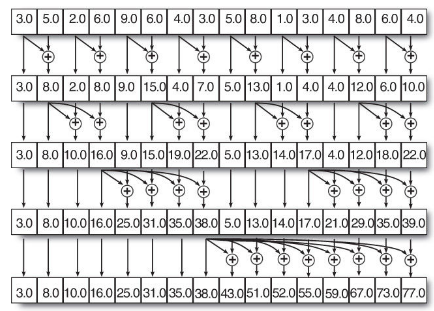

# Compute shaders

Compute shaders are a way to take advantage of the enormous computational power of graphics processors that implement OpenGL. Just like all shaders in OpenGL, they are written in GLSL and run in large parallel groups that simultaneously work on huge amounts of data. In addition to the facilities available to other shaders such as texturing, storage buffers, and atomic memory operations, compute shaders are able to synchronize with one another and share data among themselves to make general computation easier. They stand apart from the rest of the OpenGL pipeline and are designed to provide as much flexibility to the application developer as possible. In this lesson, we discuss compute shaders, examine their similarities and their differences to other shader types in OpenGL, and explain some of their unique properties and abilities.

## Using Compute Shaders

### Compile

Modern graphics processors are extremely powerful devices capable of performing a huge amount of numeric calculation. The compute shader stage is effectively its own pipeline, somewhat disconnected from the rest of OpenGL. It has no fixed inputs or outputs, does not interface with any of the fixed-function pipeline stages, is very flexible, and has capabilities that other stages do not possess.

Having said this, a compute shader is just like any other shader from a programming point of view. It is written in GLSL, represented as a shader object, and linked into a program object. When you create a compute shader, you call glCreateShader() and pass the GL_COMPUTE_SHADER parameter as the shader type. You get back a new shader object from this call that you can use to load your shader code with glShaderSource(), compile with glCompileShader(), and attach to a program object with glAttachShader(). Then, you link the program object by calling glLinkProgram(), just as you would with any graphics program.

You can’t mix and match compute shaders with shaders of other types. For example, you can’t attach a compute shader to a program object that also has a vertex or fragment shader attached to it and then link the program object. If you attempt this, the link will fail. Thus, a linked program object can contain only compute shaders or only graphics shaders (vertex, tessellation, geometry, or fragment), but not a combination of the two. We will sometimes refer to a linked program object that contains compute shaders (and so only compute shaders) as a compute program (as opposed to a graphics program, which contains only graphics shaders).

Example code to compile and link our do-nothing compute shader:

```
GLuint computeShader;
GLuint computeProgram;

static const GLchar * computeSource[] =
{
    '#version 450 core                                       \n'
    '                                                        \n'
    'layout (local_size_x = 32, local_size_y = 32) in;       \n'
    '                                                        \n'
    'void main(void)                                         \n'
    '{                                                       \n'
    '   // Do nothing                                        \n'
    '}                                                       \n'
};

// Create a shader, attach source, and compile.
computeShader = glCreateShader(GL_COMPUTE_SHADER);
glShaderSource(computeShader, 1, computeSource, NULL);
glCompileShader(computeShader);

// Create a program, attach shader, link.
computeProgram = glCreateProgram();
glAttachShader(computeProgram, computeShader);
glLinkProgram(computeProgram);

// Delete shader because we're done with it.
glDeleteShader(computeShader);
```

Once you have run the code, you will have a ready-to-run compute program in computeProgram. A compute program can use uniforms, uniform blocks, shader storage blocks, and so on, just as any other program does. You also make it current by calling glUseProgram(). Once it is the current program object, functions such as glUniform*() affect its state as normal.

###  Execute compute shaders

Once you have made a compute program current, and set up any resources that it might need access to, you need to actually execute it. To do this, we have a pair of functions:

```
void glDispatchCompute(GLuint num_groups_x,
                       GLuint num_groups_y,
                       GLuint num_groups_z);
```
and
```
void glDispatchComputeIndirect(GLintptr indirect);
```

The glDispatchComputeIndirect() function is to glDispatchCompute() as glDrawArraysIndirect() is to glDrawArraysInstancedBaseInstance(). That is, the indirect parameter is interpreted as an offset into a buffer object that contains a set of parameters that could be passed to glDispatchCompute(). In code, this structure would look like this:

```
typedef struct {
    GLuint num_groups_x;
    GLuint num_groups_y;
    GLuint num_groups_z;
} DispatchIndirectCommand;
```

However, we need to understand how these parameters are interpreted to use them effectively.

#### Global and Local Work Groups

Compute shaders execute in what are called work groups. A single call to glDispatchCompute() or glDispatchComputeIndirect() will cause a single global work group1 to be sent to OpenGL for processing. That global work group will then be subdivided into a number of local work groups — zthe number of local work groups in each of the x, y, and z dimensions is set by the num_groups_x, num_groups_y, and num_groups_z parameters, respectively. A work group is fundamentally a 3D block of work items, where each work item is processed by an invocation of a compute shader running your code. The size of each local work group in the x, y, and z dimensions is set using an input layout qualifier in your shader source code. You can see an example of this in the simple compute shader that we introduced earlier:
```
layout (local_size_x = 4,
        local_size_y = 7,
        local_size_z = 10) in;
```

In this example, the local work group size would be 4 × 7 × 10 work items or invocations, for a total of 280 work items per local work group. The maximum size of a work group can be found by querying the values of two parameters: GL_MAX_COMPUTE_WORK_GROUP_SIZE and GL_MAX_COMPUTE_WORK_GROUP_INVOCATIONS. For the first of these, you query it using the glGetIntegeri_v() function, passing it as the target parameter and 0, 1, or 2 as the index parameter to specify the x, y, or z dimension, respectively. The maximum size will be at least 1024 items in the x and y dimensions and 64 items in the z dimension. The value you get by querying the GL_MAX_COMPUTE_WORK_GROUP_INVOCATIONS constant is the maximum total number of invocations allowed in a single work group, which is the maximum allowed product of the x, y, and z dimensions, or the volume of the local work group. That value will be at least 1024 items.

It’s possible to launch 1D or 2D work groups by simply setting either the y or z dimension (or both) to 1. In fact, the default size in all dimensions is 1. Thus, if you don’t include them in your input layout qualifier, you will create a work group size of lower dimension than 3. For example,

```
layout (local_size_x = 512) in;
```

will create a 1D local work group of 512 (× 1 × 1) items and

```
layout (local_size_x = 64, local_size_y = 64) in;
```

will create a 2D local work group of 64 × 64 (× 1) items. The local work group size is used when you link the program to determine the size and dimensions of the work groups executed by the program. You can find the local work group size of a program’s compute shaders by calling glGetProgramiv() with pname set to GL_COMPUTE_WORK_GROUP_SIZE. It will return three integers giving the size of the work groups. For example, you could write

```
int size[3];

glGetProgramiv(program, GL_COMPUTE_WORK_GROUP_SIZE, size);

printf('Work group size is %d x %d x %d items.\n', size[0], size[1], size[2]);
```

Once you have defined a local work group size, you can dispatch a 3D block of workgroups to do work for you. The size of this block is specified by the num_groups_x, num_groups_y, and num_groups_z parameters to glDispatchCompute() or the equivalent members of the DispatchIndirectCommand structure stored in the buffer object bound to the GL_DISPATCH_INDIRECT_BUFFER target. This block of local work groups is known as the global work group and its dimension doesn’t need to be the same as the dimension of the local work group. That is, you could dispatch a 3D global work group of 1D local work groups, a 2D global work group of 3D local work groups, and so on.

#### Compute Shader Inputs and Outputs

First and foremost, compute shaders have no built-in outputs. They have no built-in outputs at all, and you cannot declare any user-defined outputs as you are able to do in other shader stages. This is because the compute shader forms a kind of single-stage pipeline with nothing before it and nothing after it. However, like some of the graphics shaders, it does have a few built-in input variables that you can use to determine where you are in your local work group and within the greater global work group.

The first variable, gl_LocalInvocationID, is the index of the shader invocation within the local work group. It is implicitly declared as a uvec3 input to the shader and each element ranges in value from 0 to 1 less than the local work group size in the corresponding dimension (x, y, or z). The local work group size is stored in the gl_WorkGroupSize variable, which is also implicitly declared as a uvec3 type. Again, even if you declare your local work group size to be 1D or 2D, the work group will still essentially be 3D, but with the sizes of the unused dimensions set to 1. That is, gl_LocalInvocationID and gl_WorkGroupSize will still be implicitly declared as uvec3 variables, but the y and z components of gl_LocalInvocationID will be 0 and the corresponding components for gl_WorkGroupSize will be 1.

Just as gl_WorkGroupSize and gl_LocalInvocationID store the size of the local work group and the location of the current shader invocation within the work group, so gl_NumWorkGroups and gl_WorkGroupID contain the number of work groups and the index of the current work group within the global set, respectively. Again, both are implicitly declared as uvec3 variables. The value of gl_NumWorkGroups is set by the glDispatchCompute() or glDispatchComputeIndirect() commands and contains the values of num_groups_x, num_groups_y, and num_groups_z in its three elements. The elements of gl_WorkGroupID range in value from 0 to 1 less than the values of the corresponding elements of gl_NumWorkGroups.

These variables are illustrated in next figure. The diagram shows a global work group that contains three work groups in the x dimension, four work groups in the y dimension, and eight work groups in the z dimension. Each local work group is a 2D array of work items that contains six items in the x dimension and four items in the y dimension.


Between gl_WorkGroupID and gl_LocalInvocationID, you can tell where in the complete set of work items your current shader invocation is located. Likewise, between gl_NumWorkGroups and gl_WorkGroupSize, you can figure out the total number of invocations in the global set. However, OpenGL provides the global invocation index to you through the gl_GlobalInvocationID built-in variable. It is effectively calculated as

```
gl_GlobalInvocationID = gl_WorkGroupID * gl_WorkGroupSize + gl_LocalInvocationID;
```

Finally, the gl_LocalInvocationIndex built-in variable contains a “flattened” form of gl_LocalInvocationID. That is, the 3D variable is converted to a 1D index using the following code:

```
gl_LocalInvocationIndex =
    gl_LocalInvocationID.z * gl_WorkGroupSize.x * gl_WorkGroupSize.y +
    gl_LocalInvocationID.y * gl_WorkGroupSize.x +
    gl_LocalInvocationID.x;
```

The values stored in these variables allow your shader to know where it is in the local and global work groups and can be used as indices into arrays of data, texture coordinates, or random seeds, or for any other purpose.

Now we come to outputs. We started this section by stating that compute shaders have no outputs. That’s true, but it doesn’t mean that compute shaders can’t output any data—it just means that there are no fixed outputs represented by built-in output variables, for example. Compute shaders can still produce data, but the data must be stored into memory explicitly by your shader code. For instance, in your compute shader you could write into a shader storage block, use image functions such as imageStore or atomics, or increment and decrement the values of atomic counters. These operations have side effects, which means that their operation can be detected because they update the contents of memory or otherwise have externally visible consequences.

Consider the following shader, which reads from one image, logically inverts the data, and writes the data back out to another image.

```
#version 450 core

layout (local_size_x = 32,
        local_size_y = 32) in;

layout (binding = 0, rgba32f) uniform image2D img_input;
layout (binding = 1) uniform image2D img_output;

void main(void)
{
    vec4 texel;
    ivec2 p = ivec2(gl_GlobalInvocationID.xy);

    texel = imageLoad(img_input, p);
    texel = vec4(1.0) - texel;
    imageStore(img_output, p, texel);
}
```

To execute this shader, we would compile it and link it into a program object and then set up our images by binding a level of a texture object to each of the first two image units. As you can see from previous, the local work group size is 32 invocations in x and y, so our images should ideally be integer multiples of 32 texels wide and high. Once the images are bound, we can call glDispatchCompute(), setting the num_groups_x and num_groups_y parameters to the width and height of the images divided by 32, respectively, and num_groups_z to 1. Code to do this is shown here:

```
// Bind input image
glBindImageTexture(0, tex_input, 0, GL_FALSE,0, GL_READ_ONLY, GL_RGBA32F);

// Bind output image
glBindImageTexture(1, tex_output, 0, GL_FALSE, 0, GL_WRITE_ONLY, GL_RGBA32F);

// Dispatch the compute shader
glDispatchCompute(IMAGE_WIDTH / 32, IMAGE_HEIGHT / 32, 1);
```

### Compute Shader communication

#### Shared variables

Compute shaders execute on work items in work groups much as tessellation control shaders execute on control points in patches — both work groups and patches are created from groups of invocations. Within a single patch, tessellation control shaders can write to variables qualified with the patch storage qualifier and, if they are synchronized correctly, read the values that other invocations in the same patch wrote to them. As such, this allows a limited form of communication between the tessellation control shader invocations in a single patch. However, this comes with substantial limitations — for example, the amount of storage available for patch qualified variables is fairly limited, and the number of control points in a single patch is quite small.

Compute shaders provide a similar mechanism, but offer significantly more flexibility and power. Just as you can declare variables with the patch storage qualifier in a tessellation control shader, so you can declare variables with the shared storage qualifier, which allows them to be shared between compute shader invocations running in the same local work group. Variables declared with the shared storage qualifier are known as shared variables. Access to shared variables is generally much faster than access to main memory through images or storage blocks. Thus, if you expect multiple invocations of your compute shader to access the same data, it makes sense to copy the data from main memory into a shared variable (or an array of them), access the data from there, possibly updating it in place, and then write any results back to main memory when you’re done.

Keep in mind, though, that you can use only a limited number of shared variables. A modern graphics board might have several gigabytes of main memory, whereas the amount of shared variable storage space might be limited to just a few kilobytes. The amount of shared memory available to a compute shader can be determined by calling glGetIntegerv() with pname set to GL_MAX_COMPUTE_SHARED_MEMORY_SIZE. The minimum amount of shared memory required to be supported in OpenGL is only 32 kilobytes, so while your implementation may have more than this, you shouldn’t count on it being substantially larger.

#### Synchronizing Compute Shaders

The invocations in a work group will most likely run in parallel—this is where the vast computation power of graphics processors comes from. The processor will likely divide each local work group into a number of smaller chunks (chunk sizes of 16, 32, or 64 elements are common.), executing the invocations in a single chunk in lockstep. These chunks are then time-sliced onto the processor’s computational resources and those timeslices may be assigned in any order. It may be that a chunk of invocations is completed before any other chunks from the same local work group begin, but more than likely there will be many “live” chunks present on the processor at any given time.

Because these chunks can effectively run out of order but are allowed to communicate, we need a way to ensure that messages received by a recipient are the most recent ones sent. Imagine if you were told to go to someone’s office and perform the duty written on that individual’s whiteboard. Each day, this person writes a new message on the whiteboard, but you don’t know at what time that happens. When you go into the office, how do you know if the message on the whiteboard is what you’re supposed to do, or if it’s left over from the previous day? You’d be in a bit of trouble. Now suppose the owner of the office left the door locked until he or she had been there and written the message. If you showed up and the door was locked, you’d have to wait outside the office. This is known as a barrier. If the door is open, you can look at the message; if it’s locked, you need to wait until the person arrives to open it.

A similar mechanism is available to compute shaders: the barrier() function, which executes a flow control barrier. When you call barrier() in your compute shader, it will be blocked until all other shader invocations in the same local work group have reached that point in the shader. In a time-slicing architecture, executing the barrier() function means that your shader (along with the chunk it’s in) will give up its timeslice so that another invocation can execute until it reaches the barrier. Once all the other invocations in the local work group reach the barrier (or if they have already gotten there before your invocation arrives) execution continues as usual.

Flow control barriers are important when shared memory is in use because they allow you to know when other shader invocations in the same local work group have reached the same point as the current invocation. If the current invocation has written to some shared memory variable, then you know that all the others must have written to theirs as well, so it’s safe to read the data they wrote. Without a barrier, you would have no idea whether data that was supposed to have been written to shared variables actually has been. At best, you’d leave your application susceptible to race conditions; at worst, the application wouldn’t work at all. Consider, for example, the shader shown here:

```
#version 450 core

layout (local_size_x = 1024) in;

layout (binding = 0, r32ui) uniform uimageBuffer image_in;

layout (binding = 1) uniform uimageBuffer image_out;

shared uint temp_storage[1024];

void main(void)
{
    // Load from the input image
    uint n = imageLoad(image_in, gl_LocalInvocationID.x).x;

    // Store into shared storage
    temp_storage[gl_LocalInvocationID.x] = n;

    // Uncomment this to avoid the race condition
    // barrier();
    // memoryBarrierShared();

    // Read the data written by the invocation 'to the left'
    n = temp_storage[(gl_LocalInvocationID.x - 1) & 1023];

    // Write new data into the buffer
    imageStore(image_out, gl_LocalInvocationID.x, n);
}
```

This shader loads data from a buffer image into a shared variable. Each invocation of the shader loads a single item from the buffer and writes it into its own “slot” in the shared variable array. Then, it reads from the slot owned by the invocation to its left and writes the data out to the buffer image. The result should be that the data in the buffer is moved along by one element. However, following figures illustrates what actually happens.


As you can see in the figure, multiple shader invocations have been time-sliced onto a single computational resource. At t0, invocation A runs the first couple of lines of the shader and writes its value to temp_storage. At t1, invocation B runs a line and then at t2, invocation C takes over and runs the same first two lines of the shader. At time t3, A gets its timeslice back again and completes the shader. It’s done at this point, but the other invocations haven’t finished their work yet. At t4, invocation D finally gets a turn but is quickly interrupted by invocation C, which reads from temp_storage. Now we have a problem: Invocation C was expecting to read data from the shared storage that was written by invocation B, but invocation B hasn’t reached that point in the shader yet! Execution continues blindly, and invocations D, C, and B all finish the shader, but the data stored by C will be garbage.

This is known as a race condition. The shader invocations race each other to the same point in the shader, and some invocations will read from the temp_storage shared variable before others have written their data into it. The result is that they pick up stale data, which then gets written into the output buffer image. Uncommenting the call to barrier() in code produces an execution flow more like that shown here:


Compare figures. Both depict four shader invocations being time-sliced onto the same computational resource, except that second figure does not exhibit the race condition. In second figure, we again start with shader invocation A executing the first couple of lines of the shader, but then it calls the barrier() function, which causes it to yield its timeslice. Next, invocation B executes the first couple of lines and then is preempted. Then, C executes the shader as far as the barrier() function and so yields. Invocation B executes its barrier but gets no further because D still has not reached the barrier function. Finally, invocation D gets a chance to run reads from the image buffer, writes its data into the shared storage area, and then calls barrier(). This signals all the other invocations that it is safe to continue running.

Immediately after invocation D executes the barrier, all other invocations are able to run again. Invocation C loads from the shared storage, then D, and C and D both store their results to the image. Finally invocations A and B read from the shared storage and write their results out to memory. As you can see, no invocation tried to read data that hasn’t been written yet. The presence of the barrier() functions affected the scheduling of the invocations with respect to one another. Although these diagrams show only four invocations competing for a single resource, in real OpenGL implementations there are likely to be many hundreds of threads competing for perhaps a few tens of resources. As you might guess, the likelihood of data corruption due to race conditions is much higher in these scenarios.

## Examples

This section contains several examples of the use of compute shaders. In our first example, the parallel prefix sum, we demonstrate how to implement an algorithm (which at first seems like a very serial process) in an efficient parallel manner. In our second example, we will demonstrate how to use both a compute shader and a render shade pipeline, by drawing a simple colored grid on a texture. In the third example, we will use the massive parallelization allowed by compute shaders to implement a pathtracing renderer. In our fourth and last example, an implementation of the classic flocking algorithm (also known as boids) is shown. In all examples, we make use of local and global work groups, synchronization using the barrier() command, and shared local variables — a feature unique to compute shaders.

### Compute Shader Parallel Prefix Sum

A prefix sum operation is an algorithm that, given an array of input values, computes a new array where each element of the output array is the sum of all of the values of the input array up to (and optionally including) the current array element. A prefix sum operation that includes the current element is known as an inclusive prefix sum; one that does not is known as an exclusive prefix sum.

The following code is a simple C++ implementation of a prefix sum function that can be inclusive or exclusive:

```
void prefixSum(const float * inArray, float * outArray, int elements, bool inclusive)
{
    float f = 0.0f;
    int i;

    if (inclusive) {
        for (i = 0; i < elements; i++) {
            f += inArray[i];
            outArray[i] = f;
        }
    } else {
        for (i = 0; i < elements; i++) {
            outArray[i] = f;
            f += inArray[i];
        }
    }
}
```

Notice that the only difference between the inclusive and exclusive prefix sum implementations is that the accumulation of the input array is performed before writing to the output array rather than afterward.

You should appreciate that as the number of elements in the input and output arrays grows, the number of addition operations grows, too—and can become quite large. Also, given that the result written to each element of the output array is the sum of all elements before it (and therefore dependent on all of them), it would seem at first glance that this type of algorithm does not lend itself well to parallelization. However, this is not the case: The prefix sum operation is highly parallizable. At is core, the prefix sum is nothing more than a huge number of additions of adjacent array elements. Take, for example, a prefix sum of four input elements, I0 through I3, producing an output array O0 through O3. The result is

O0 = I0
O1 = I0 + I1
O2 = I0 + I1 + I2
O3 = I0 + I1 + I2 + I3

The key to parallization is to break large tasks into groups of smaller, independent tasks that can be completed independently of one another. You can see that in the computation of O2 and O3, we use the sum of I0 and I1, which we also need to calculate O1. So, if we break this operation into multiple steps, we see that we have in the first step

O0 = I0
O1 = I0 + I1
O2 = I2
O3 = I2 + I3

Then in a second step, we can compute

O2 = O2 + O1
O3 = O3 + O1

Now, the computations of O1 and O3 are independent of each other in the first step and therefore can be computed in parallel, as can the updates of the values of O2 and O3 in the second step. If you look closely, you will see that the first step simply takes a four-element prefix sum and breaks it into a pair of two-element prefix sums that are trivially computed. In the second step, we use the result of the previous step to update the results of the inner sums. In fact, we can break a prefix sum of any size into smaller and smaller chunks until we reach a point where we can compute the inner sum directly.



The recursive nature of this algorithm is now apparent. The number of additions required by this method is actually more than the sequential algorithm for prefix sum calculation would require. In this example, we would require 15 additions to compute the prefix sum with a sequential algorithm, whereas here we require 8 additions per step and 4 steps for a total of 32 additions. However, because we can execute the 8 additions of each step in parallel, we are done in 4 steps instead of 15, making the algorithm amost 4 times faster than the sequential one.

As the number of elements in the input array grows, the potential speedup becomes greater. For example, if we expand the input array to 32 elements, we execute 5 steps of 16 additions each, rather than 31 sequential additions. Assuming we have enough computational resources to perform 16 additions at a time, we now take 5 steps instead of 31 and go around 6 times faster. Likewise, for an input array size of 64, we’d take 6 steps of 32 additions rather than 63 sequential additions, and go 10 times faster! Of course, we eventually hit a limit in the number of additions we can perform in parallel, the amount of memory bandwidth we consume when reading and writing the input and output arrays, or something else.

To implement this operation in a compute shader, we can load a chunk of input data into shared variables, compute the inner sums, synchronize with the other invocations, accumulate their results, and so on. An example compute shader that implements this algorithm is shown here:

```
#version 450 core

layout (local_size_x = 1024) in;

layout (binding = 0) coherent buffer block1
{
    float input_data[gl_WorkGroupSize.x];
};

layout (binding = 1) coherent buffer block2
{
    float output_data[gl_WorkGroupSize.x];
};

shared float shared_data[gl_WorkGroupSize.x * 2];

void main(void)
{
    uint id = gl_LocalInvocationID.x;
    uint rd_id;
    uint wr_id;
    uint mask;

    // The number of steps is the log base 2 of the
    // work group size, which should be a power of 2
    const uint steps = uint(log2(gl_WorkGroupSize.x)) + 1;
    uint step = 0;

    // Each invocation is responsible for the content of
    // two elements of the output array
    shared_data[id * 2] = input_data[id * 2];
    shared_data[id * 2 + 1] = input_data[id * 2 + 1];

    // Synchronize to make sure that everyone has initialized
    // their elements of shared_data[] with data loaded from
    // the input arrays
    barrier();
    memoryBarrierShared();

    // For each step...
    for (step = 0; step < steps; step++)
    {
        // Calculate the read and write index in the
        // shared array
        mask = (1 << step) - 1;
        rd_id = ((id >> step) << (step + 1)) + mask;
        wr_id = rd_id + 1 + (id & mask);

        // Accumulate the read data into our element
        shared_data[wr_id] += shared_data[rd_id];

        // Synchronize again to make sure that everyone
        // has caught up with us
        barrier();
        memoryBarrierShared();
    }

    // Finally write our data back to the output image
    output_data[id * 2] = shared_data[id * 2];
    output_data[id * 2 + 1] = shared_data[id * 2 + 1];
}
```

The shader shown here has a local workgroup size of 1024, which means it will process arrays of 2048 elements, as each invocation computes two elements of the output array. The shared variable shared_data is used to store the data that is in flight. When execution starts, the shader loads two adjacent elements from the input arrays into the array. Next, it executes the barrier() function. This step ensures that all of the shader invocations have loaded their data into the shared array before the inner loop begins.

Each iteration of the inner loop performs one step of the algorithm. This loop executes log2(N) times, where N is the number of elements in the array. For each invocation, the shader calculates the index of the first and second elements to be added together and then computes the sum, writing the result back into the shared array. At the end of the loop, another call to barrier() ensures that the invocations are fully synchronized before the next iteration of the loop and ultimately when the loop exits. Finally, the shader writes the result to the output buffer.

### Compute Shader Grid

In this example, we will generate a grid texture and display it on a quad. This will allow us to use a simple combination of computer then rendering shaders.

Here is an overview of what we will do:

1. We'll define a fixed size of the work to complete in terms of number of jobs - the count of work groups. OpenGL calls this the global work group. In our example, we decide to create a texture through 80 * 45 patches of 16 * 16 pixels. Each patch will be a work group. We later define how to sub-divide this into smaller groups of jobs - local work groups. In our example, the local work groups will each one handle one pixel.

2. We'll write a compute shader to process any one job within a work group. i.e. colour one group of pixels. In the shader you also define how the global work group should be sub-divided into smaller local work groups of jobs (this is a bit of a strange place to do this, as it doesn't affect the way we write our shader code at all).

3. We'll set up shader storage blocks or images that the compute shader can read from or write to. We may also use uniforms as per normal. i.e. create a texture with the dimensions of the 2d image.

4. We'll call glDispatchCompute() and OpenGL will launch as many compute shader invocations as it requires to complete your work group. It will try to do these in parallel, if possible. They are invoked in no fixed order.

First, let's prepare our scene and the opengl variables we will use:

`Scene_023_ComputeShaderGrid.h`
```
#ifndef Scene_023_ComputeShaderGrid_H
#define Scene_023_ComputeShaderGrid_H

#include "../engine/Scene.h"
#include "../engine/Assets.h"

struct Coords {
  GLfloat x;
  GLfloat y;
  GLfloat s;
  GLfloat t;
};

struct Rgba {
  GLfloat Red;
  GLfloat Green;
  GLfloat Blue;
  GLfloat Alpha;
};

class Scene_023_ComputeShaderGrid : public Scene {
public:
    Scene_023_ComputeShaderGrid();
    ~Scene_023_ComputeShaderGrid();
    void load();
    void clean();
    void pause();
    void resume();
    void handleEvent(const InputState &);
    void update(float dt);
    void draw();
    void setGame(Game *);

private:
    Game *game;

    Coords* quadTexture;
    Rgba* quadVertex;
    unsigned short int* quadIndex;

    GLuint quadIBO;
    GLuint quadVBO;
    GLuint quadVAO;
    GLuint quadTextureID;

    ComputeShader computeShader;
    Shader renderShader;
};

#endif //Scene_023_ComputeShaderGrid_H
```

In the scene's load function, we first need to setup the quad we will use, the VAO, VBO and IBO (indexes), and finally the texture. We prepare a texture for a 1280*720 display.

`Scene_023_ComputeShaderGrid.cpp`
```
void Scene_023_ComputeShaderGrid::load() {
    // Create quads
    Rgba * quadTexture = new Rgba[1280 * 720];
    Coords * quadVertex = new Coords[4];
    unsigned short int * quadIndex = new unsigned short int[3];

    quadVertex[0].x = -1.0f;
    quadVertex[0].y = 1.0f;

    quadVertex[1].x = -1.0f;
    quadVertex[1].y = -1.0f;

    quadVertex[2].x = 1.0f;
    quadVertex[2].y = 1.0f;

    quadVertex[3].x = 1.0f;
    quadVertex[3].y = -1.0f;

    quadIndex[0] = 0;
    quadIndex[1] = 1;
    quadIndex[2] = 2;
    quadIndex[3] = 3;

    quadVertex[0].s = 0.0f;
    quadVertex[0].t = 0.0f;
    quadVertex[1].s = 0.0f;
    quadVertex[1].t = 1.0f;
    quadVertex[2].s = 1.0f;
    quadVertex[2].t = 0.0f;
    quadVertex[3].s = 1.0f;
    quadVertex[3].t = 1.0f;

    for (int x = 0; x < 1280; x++) {
        for (int y = 0; y < 720; y++) {
            quadTexture[x + y * 1280].Red = 1.0f;
            quadTexture[x + y * 1280].Green = .5f;
            quadTexture[x + y * 1280].Blue = .0f;
            quadTexture[x + y * 1280].Alpha = 1.0f;
        }
    }

    // Setup texture
    glGenTextures(1, &quadTextureID);
    glBindTexture(GL_TEXTURE_2D, quadTextureID);
    glTexParameteri(GL_TEXTURE_2D, GL_TEXTURE_WRAP_S, GL_CLAMP_TO_EDGE);
    glTexParameteri(GL_TEXTURE_2D, GL_TEXTURE_WRAP_T, GL_CLAMP_TO_EDGE);
    glTexParameteri(GL_TEXTURE_2D, GL_TEXTURE_MAG_FILTER, GL_LINEAR);
    glTexParameteri(GL_TEXTURE_2D, GL_TEXTURE_MIN_FILTER, GL_LINEAR);
    glGenerateMipmap(GL_TEXTURE_2D);
    glTexImage2D(GL_TEXTURE_2D, 0, GL_RGBA32F, 1280, 720, 0, GL_RGBA, GL_FLOAT, NULL);
    glBindTexture(GL_TEXTURE_2D, 0);

    glGenBuffers(1, &quadIBO);
    glBindBuffer(GL_ELEMENT_ARRAY_BUFFER, quadIBO);
    glBufferData(GL_ELEMENT_ARRAY_BUFFER, 4 * sizeof(unsigned short int), quadIndex, GL_STATIC_DRAW);
    glBindBuffer(GL_ELEMENT_ARRAY_BUFFER, 0);

    glGenBuffers(1, &quadVBO);
    glBindBuffer(GL_ARRAY_BUFFER, quadVBO);
    glBufferData(GL_ARRAY_BUFFER, sizeof(Coords) * 4, 0, GL_STATIC_DRAW);
    glBufferSubData(GL_ARRAY_BUFFER, 0, sizeof(Coords) * 4, quadVertex);
    glBindBuffer(GL_ARRAY_BUFFER, 0);

    glGenVertexArrays(1, &quadVAO);
    glBindVertexArray(quadVAO);

    glBindBuffer(GL_ELEMENT_ARRAY_BUFFER, quadIBO);

    glBindBuffer(GL_ARRAY_BUFFER, quadVBO);
    glVertexAttribPointer(0, 2, GL_FLOAT, GL_FALSE, 4 * sizeof(GLfloat), 0);
    glEnableVertexAttribArray(0);
    glVertexAttribPointer(1, 2, GL_FLOAT, GL_FALSE, 4 * sizeof(GLfloat), (GLvoid *)(sizeof(GLfloat) * 2));
    glEnableVertexAttribArray(1);

    glBindVertexArray(0);
    ...
```

We will now setup the compute shader itself. Our goal is to draw patches of 16*16 texels with two colors, organized in a grid stucture.

We decide each workgroup will have a local size of 16 * 16 invocations of the compute shader. Therefore, each workgroup unit will choose the color of a single texel. We will choose to trigger 80 * 45 * 1 workgroups, in order for the 16*16 patches to fill up a 1280 * 720 window. We will draw the colors in an image2D dataset, passed as a uniform.

`023_ComputeShaderGrid.glsl`
```
#version 450

// We will draw patches of 16*16 pixels, 80*45 times for a final 1280*720 image
layout (local_size_x = 16, local_size_y = 16) in;

// No data input: the compute shader will create the image output.
layout (rgba32f, binding = 0) uniform image2D img_output;

void main() {
  // gl_LocalInvocationID.xy * gl_WorkGroupID.xy == gl_GlobalInvocationID
  ivec2 coords = ivec2(gl_GlobalInvocationID);

  // We want to draw an orange and blue grid
  vec4 pixel;
  // Orange alternance: when workgroup x is even we want workgroup y to be odd, and vice-versa
  if ( ((gl_WorkGroupID.x & 1u) != 1u) != ((gl_WorkGroupID.y & 1u) == 1u)) {
    pixel = vec4(1.0,.5,.0,1.0);
  }
  // Blue alternance in case orange condition is not met
  else {
    pixel = vec4(.0,.5,1.0,1.0);
  }

  imageStore(img_output, coords, pixel);
}
```

The vertex and the fragment shaders are just a simple quad + uv classic shader program.

`023_ComputeShaderGrid.vert`
```
#version 450

in vec3 vertex;
layout(location = 0) in vec2 position;
layout(location = 1) in vec2 texCoord;

out vec4 inColor;
out vec2 outTexCoord;

void main() {
  gl_Position = vec4(position, .5f, 1.0f);
  inColor = gl_Position;
  outTexCoord = texCoord;
}
```

`023_ComputeShaderGrid.frag`
```
#version 450

in vec4 inColor;
in vec2 outTexCoord;
out vec4 color;

uniform sampler2D currentTexture;

void main() {
  color = texture(currentTexture, outTexCoord);
}
```

We will load those shaders and run the compute shader in the last part of the scene's load function:

`Scene_023_ComputeShaderGrid.cpp`
```
void Scene_023_ComputeShaderGrid::load() {
    ...
    // Load shaders
    Assets::loadComputeShader(SHADER_COMP(SHADER_NAME), SHADER_ID(SHADER_NAME));
    Assets::loadShader(SHADER_VERT(SHADER_NAME), SHADER_FRAG(SHADER_NAME), "", "", "", SHADER_ID(SHADER_NAME));

    computeShader = Assets::getComputeShader(SHADER_ID(SHADER_NAME));
    renderShader = Assets::getShader(SHADER_ID(SHADER_NAME));

    // Run Compute shader
    computeShader.use();
    glBindTexture(GL_TEXTURE_2D, quadTextureID);
    glBindImageTexture(0, quadTextureID, 0, GL_FALSE, 0, GL_WRITE_ONLY, GL_RGBA32F);
    glDispatchCompute(1280, 720, 1);
    glMemoryBarrier(GL_SHADER_IMAGE_ACCESS_BARRIER_BIT);

    // Unbind
    glBindImageTexture(0, 0, 0, GL_FALSE, 0, GL_WRITE_ONLY, GL_RGBA32F);
    glBindTexture(GL_TEXTURE_2D, 0);
    glUseProgram(0);
}
```

Now, we just have to draw the texture using the render shader program in the draw function:

`Scene_023_ComputeShaderGrid.cpp`
```
void Scene_023_ComputeShaderGrid::draw()
{
    glEnable(GL_CULL_FACE);
    renderShader.use();
    glBindVertexArray(quadVAO);

    glActiveTexture(GL_TEXTURE0);
    glBindTexture(GL_TEXTURE_2D, quadTextureID);
    glDrawElements(GL_TRIANGLE_STRIP, 4, GL_UNSIGNED_SHORT, (GLvoid *)0);

    // If you want to unbind everything
    glBindTexture(GL_TEXTURE_2D, 0);
    glActiveTexture(0);
    glBindVertexArray(0);
    glUseProgram(0);
}
```

Do not forget to clean the quad pointers at the end of the scene:

`Scene_023_ComputeShaderGrid.cpp`
```
void Scene_023_ComputeShaderGrid::clean() {
    delete quadTexture;
    delete quadVertex;
    delete quadIndex;
}
```

When you launch your code, you should see a nice and square color grid, the result of your first interaction beteen a compute shader and rendering shaders.

### Compute Shader raytracing

In this example, we will setup a basic raytracing renderer through a compute shader. The gloabl workflow concerning compute shaders will be the same as just above, with a difference : we will create one workgroup for each pixel we want to compute.

Rather than cast rays from a light, we can go in reverse and just cast rays from the eye (each pixel of the output image). If we assume an orthographic projection then the rays all just go straight forwards in the camera direction. For each ray, we will test it for intersection with all objects in a simple scene. If we stop there and ignore reflections and lighting then the pixel takes the colour of whatever object its ray intersects with first.

Creating the texture is rather similar than what we did in the previous exemple. This time, we want a 512 * 512 texture and will change the UV coordinates to display is squared - you could also create a view matrix.

`Scene_024_ComputeShaderRaytracing.cpp`
```
void Scene_024_ComputeShaderRaytracing::load() {
    // Create quads
    Rgba * quadTexture = new Rgba[512 * 512];
    Coords * quadVertex = new Coords[4];
    unsigned short int * quadIndex = new unsigned short int[3];

    quadVertex[0].x = -512.0f/1280.0f * 1.5f;
    quadVertex[0].y = 1.0f;

    quadVertex[1].x = -512.0f/1280.0f * 1.5f;
    quadVertex[1].y = -1.0f;

    quadVertex[2].x = 512.0f/1280.0f * 1.5f;
    quadVertex[2].y = 1.0f;

    quadVertex[3].x = 512.0f/1280.0f * 1.5f;
    quadVertex[3].y = -1.0f;

    quadIndex[0] = 0;
    quadIndex[1] = 1;
    quadIndex[2] = 2;
    quadIndex[3] = 3;

    quadVertex[0].s = 0.0f;
    quadVertex[0].t = 0.0f;
    quadVertex[1].s = 0.0f;
    quadVertex[1].t = 1.0f;
    quadVertex[2].s = 1.0f;
    quadVertex[2].t = 0.0f;
    quadVertex[3].s = 1.0f;
    quadVertex[3].t = 1.0f;

    for (int x = 0; x < 512; x++) {
        for (int y = 0; y < 512; y++) {
            quadTexture[x + y * 512].Red = 1.0f;
            quadTexture[x + y * 512].Green = .5f;
            quadTexture[x + y * 512].Blue = .0f;
            quadTexture[x + y * 512].Alpha = 1.0f;
        }
    }

    // Setup texture
    glGenTextures(1, &quadTextureID);
    glActiveTexture(GL_TEXTURE0);
    glBindTexture(GL_TEXTURE_2D, quadTextureID);
    glTexParameteri(GL_TEXTURE_2D, GL_TEXTURE_WRAP_S, GL_CLAMP_TO_EDGE);
    glTexParameteri(GL_TEXTURE_2D, GL_TEXTURE_WRAP_T, GL_CLAMP_TO_EDGE);
    glTexParameteri(GL_TEXTURE_2D, GL_TEXTURE_MAG_FILTER, GL_LINEAR);
    glTexParameteri(GL_TEXTURE_2D, GL_TEXTURE_MIN_FILTER, GL_LINEAR);
    glTexImage2D(GL_TEXTURE_2D, 0, GL_RGBA32F, texWidth, texHeight, 0, GL_RGBA, GL_FLOAT, NULL);
    glBindImageTexture(0, quadTextureID, 0, GL_FALSE, 0, GL_WRITE_ONLY, GL_RGBA32F);

    // OpenGL setup
    glGenBuffers(1, &quadIBO);
    glBindBuffer(GL_ELEMENT_ARRAY_BUFFER, quadIBO);
    glBufferData(GL_ELEMENT_ARRAY_BUFFER, 4 * sizeof(unsigned short int), quadIndex, GL_STATIC_DRAW);
    glBindBuffer(GL_ELEMENT_ARRAY_BUFFER, 0);

    glGenBuffers(1, &quadVBO);
    glBindBuffer(GL_ARRAY_BUFFER, quadVBO);
    glBufferData(GL_ARRAY_BUFFER, sizeof(Coords) * 4, 0, GL_STATIC_DRAW);
    glBufferSubData(GL_ARRAY_BUFFER, 0, sizeof(Coords) * 4, quadVertex);
    glBindBuffer(GL_ARRAY_BUFFER, 0);

    glGenVertexArrays(1, &quadVAO);
    glBindVertexArray(quadVAO);

    glBindBuffer(GL_ELEMENT_ARRAY_BUFFER, quadIBO);

    glBindBuffer(GL_ARRAY_BUFFER, quadVBO);
    glVertexAttribPointer(0, 2, GL_FLOAT, GL_FALSE, 4 * sizeof(GLfloat), 0);
    glEnableVertexAttribArray(0);
    glVertexAttribPointer(1, 2, GL_FLOAT, GL_FALSE, 4 * sizeof(GLfloat), (GLvoid *)(sizeof(GLfloat) * 2));
    glEnableVertexAttribArray(1);

    glBindVertexArray(0);


    // Load shaders
    Assets::loadComputeShader(SHADER_COMP(SHADER_NAME), SHADER_ID(SHADER_NAME));
    Assets::loadShader(SHADER_VERT(SHADER_NAME), SHADER_FRAG(SHADER_NAME), "", "", "", SHADER_ID(SHADER_NAME));

    computeShader = Assets::getComputeShader(SHADER_ID(SHADER_NAME));
    renderShader = Assets::getShader(SHADER_ID(SHADER_NAME));
}
```

By the way, the class variables are the same as in the previous example:

`Scene_024_ComputeShaderRaytracing.h`
```
    Game *game;

    int texWidth { 512 };
    int texHeight { 512 };

    Coords* quadTexture;
    Rgba* quadVertex;
    unsigned short int* quadIndex;

    GLuint quadIBO;
    GLuint quadVBO;
    GLuint quadVAO;
    GLuint quadTextureID;

    ComputeShader computeShader;
    Shader renderShader;
```

Now, we will implement the computer shader. We will use an algorithm similar to the raytracing course algorithm. We will draw rays to hit a sphere. The scene itself is hardcoded into the compute shader. Here are two images as a mathematical reminder.


Here is the compute shader :

`024_ComputeShaderRaytracing.glsl`
```
#version 450

layout(local_size_x = 1, local_size_y = 1) in;
layout(rgba32f, binding = 0) uniform image2D img_output;

void main() {
  // Base pixel colour for image
  vec4 pixel = vec4(0.0, 0.0, 0.0, 1.0);
  // Get index in global work group i.e x,y position
  ivec2 pixel_coords = ivec2(gl_GlobalInvocationID.xy);

  // Hard coded scene
  vec3 sphere_c = vec3(0.0, 0.0, -10.0);
  float sphere_r = 1.0;

  float max_x = 5.0;
  float max_y = 5.0;
  ivec2 dims = imageSize(img_output); // fetch image dimensions
  float x = (float(pixel_coords.x * 2 - dims.x) / dims.x);
  float y = (float(pixel_coords.y * 2 - dims.y) / dims.y);
  vec3 ray_o = vec3(x * max_x, y * max_y, 0.0);
  vec3 ray_d = vec3(0.0, 0.0, -1.0); // ortho

  vec3 omc = ray_o - sphere_c;
  float b = dot(ray_d, omc);
  float c = dot(omc, omc) - sphere_r * sphere_r;
  float bsqmc = b * b - c;
  // Hit one or both sides
  if (bsqmc >= 0.0) {
    pixel = vec4(0.4, 0.4, 1.0, 1.0);
  }

  // Output to a specific pixel in the image
  imageStore(img_output, pixel_coords, pixel);
}
```

For the rendering part, we first execute the compute shader then the render shader.

`Scene_024_ComputeShaderRaytracing.cpp`
```
void Scene_024_ComputeShaderRaytracing::draw()
{
    // Launch compute shaders!
    computeShader.use();
    glDispatchCompute((GLuint)texWidth, (GLuint)texHeight, 1);

    // Make sure writing to image has finished before read
    glMemoryBarrier(GL_SHADER_IMAGE_ACCESS_BARRIER_BIT);

    // normal drawing pass
    renderShader.use();
    glBindVertexArray(quadVAO);
    glActiveTexture(GL_TEXTURE0);
    glBindTexture(GL_TEXTURE_2D, quadTextureID);
    glDrawArrays(GL_TRIANGLE_STRIP, 0, 4);
}
```

The final image is very rough, but you could improve it by extending the raytracing algorithm.

### Compute Shader Boids

The following example uses a compute shader to implement a flocking algorithm. Flocking algorithms show emergent behavior within a large group by updating the properties of individual members independently of all others. This kind of behavior is regularly seen in nature, and examples are swarms of bees, flocks of birds, and schools of fish apparently moving in unison even though the members of the group don’t communicate globally. That is, the decisions made by an individual are based solely on its perception of the other nearby members of the group. However, no collaboration is made between members over the outcome of any particular decision: As far as we know, schools of fish don’t have leaders. Because each member of the group is effectively independent, the new value of each of the properties can be calculated in parallel—ideal for a GPU implementation.

Here, we implement the flocking algorithm in a compute shader. We represent each member of the flock as a single element stored in a shader storage buffer. Each member has a position and a velocity that are updated by a compute shader, which reads the current values from one buffer and writes the result into another buffer. That buffer is then bound as a vertex buffer and used as an instanced input to the rendering vertex shader. Each member of the flock is an instance in the rendering draw. The vertex shader is responsible for transforming a mesh (in this case, a simple model of a paper airplane) into the position and orientation calculated in the first vertex shader. The algorithm then iterates, starting again with the compute shader, reusing the positions and velocities calculated in the previous pass. No data leaves the graphics card’s memory, and the CPU is not involved in any calculations.

We use a pair of buffers to store the current positions of the members of the flock. We use a set of VAOs to represent the vertex array state for each pass so that we can render the resulting data. These VAOs also hold the the vertex data for the model we use to represent them. The flock positions and velocities need to be double-buffered because we don’t want to partially update the position or velocity buffer while at the same time using them as a source for drawing commands. Next figure illustrates the passes that the algorithm makes.


In the top left image, we perform the update for an even frame. The first buffer containing position and velocity data is bound as a shader storage buffer that can be read by the compute shader, and the second buffer is bound such that it can be written by the compute shader. Next we render, in the top right image, using the same set of buffers as inputs as in the update pass. We use the same buffers as input in both the update and render passes so that the render pass has no dependency on the update pass. As a consequence, OpenGL may be able to start working on the render pass before the update pass has finished. The buffer containing the position and velocity data for the flock members is used to source instanced vertex attributes, and the additional geometry buffer is used to provide vertex position data.

In the bottom left image in figure, we move to the next frame. The buffers have been exchanged—the second buffer is now the input to the compute shader, and the first buffer is written by it. Finally, in the bottom right image, we render the odd frames. The second buffer is used as input to the vertex shader. Notice, though, that the flock_geometry buffer is a member of both rendering VAOs because the same data is used in both passes; consequently, we don’t need two copies of it.

Let's first prepare our scene:

`Scene_025_ComputeShaderBoids.h`
```
constexpr int WORKGROUP_SIZE = 256;
constexpr int NUM_WORKGROUPS = 64;
constexpr int FLOCK_SIZE = (NUM_WORKGROUPS * WORKGROUP_SIZE);

struct FlockMember
{
    Vector3 position;
    unsigned int : 32;
    Vector3 velocity;
    unsigned int : 32;
};

class Scene_025_ComputeShaderBoids : public Scene {
public:
    Scene_025_ComputeShaderBoids();
    ~Scene_025_ComputeShaderBoids();
    void load();
    void clean();
    void pause();
    void resume();
    void handleEvent(const InputState &);
    void update(float dt);
    void draw();
    void setGame(Game *);

private:
    Game *game;
    float totalTime;

    ComputeShader computeShader;
    Shader renderShader;

    GLuint flockBuffer[2];
    GLuint flockRenderVao[2];
    GLuint geometryBuffer;
    GLuint frameIndex;
};

static inline float randomFloat()
{
    static unsigned int seed = 0x13371337;

    float res;
    unsigned int tmp;

    seed *= 16807;
    tmp = seed ^ (seed >> 4) ^ (seed << 15);
    *((unsigned int *) &res) = (tmp >> 9) | 0x3F800000;

    return (res - 1.0f);
}
```

We will now see how the loading happens. The code to set all that up isn’t particularly complex, but there is a fair amount of repetition, making it long.

`Scene_025_ComputeShaderBoids.cpp`
```
void Scene_025_ComputeShaderBoids::load() {
    Assets::loadComputeShader(SHADER_COMP(SHADER_NAME), SHADER_ID(SHADER_NAME));
    Assets::loadShader(SHADER_VERT(SHADER_NAME), SHADER_FRAG(SHADER_NAME), "", "", "", SHADER_ID(SHADER_NAME));

    // This is position and normal data for a paper airplane
    static const Vector3 geometry[] =
    {
        // Positions
        Vector3(-5.0f, 1.0f, 0.0f),
        Vector3(-1.0f, 1.5f, 0.0f),
        Vector3(-1.0f, 1.5f, 7.0f),
        Vector3(0.0f, 0.0f, 0.0f),
        Vector3(0.0f, 0.0f, 10.0f),
        Vector3(1.0f, 1.5f, 0.0f),
        Vector3(1.0f, 1.5f, 7.0f),
        Vector3(5.0f, 1.0f, 0.0f),

        // Normals
        Vector3(0.0f, 0.0f, 0.0f),
        Vector3(0.0f, 0.0f, 0.0f),
        Vector3(0.107f, -0.859f, 0.00f),
        Vector3(0.832f, 0.554f, 0.00f),
        Vector3(-0.59f, -0.395f, 0.00f),
        Vector3(-0.832f, 0.554f, 0.00f),
        Vector3(0.295f, -0.196f, 0.00f),
        Vector3(0.124f, 0.992f, 0.00f),
    };

    computeShader = Assets::getComputeShader(SHADER_ID(SHADER_NAME));
    renderShader = Assets::getShader(SHADER_ID(SHADER_NAME));

    glGenBuffers(2, flockBuffer);
    glBindBuffer(GL_SHADER_STORAGE_BUFFER, flockBuffer[0]);
    glBufferData(GL_SHADER_STORAGE_BUFFER, FLOCK_SIZE * sizeof(FlockMember), NULL, GL_DYNAMIC_COPY);
    glBindBuffer(GL_SHADER_STORAGE_BUFFER, flockBuffer[1]);
    glBufferData(GL_SHADER_STORAGE_BUFFER, FLOCK_SIZE * sizeof(FlockMember), NULL, GL_DYNAMIC_COPY);

    int i;

    glGenBuffers(1, &geometryBuffer);
    glBindBuffer(GL_ARRAY_BUFFER, geometryBuffer);
    glBufferData(GL_ARRAY_BUFFER, sizeof(geometry), geometry, GL_STATIC_DRAW);

    glGenVertexArrays(2, flockRenderVao);

    for (i = 0; i < 2; i++)
    {
        glBindVertexArray(flockRenderVao[i]);
        glBindBuffer(GL_ARRAY_BUFFER, geometryBuffer);
        glVertexAttribPointer(0, 3, GL_FLOAT, GL_FALSE, 0, NULL);
        glVertexAttribPointer(1, 3, GL_FLOAT, GL_FALSE, 0, (void *)(8 * sizeof(Vector3)));

        glBindBuffer(GL_ARRAY_BUFFER, flockBuffer[i]);
        glVertexAttribPointer(2, 3, GL_FLOAT, GL_FALSE, sizeof(FlockMember), NULL);
        glVertexAttribPointer(3, 3, GL_FLOAT, GL_FALSE, sizeof(FlockMember), (void *)sizeof(Vector4));
        glVertexAttribDivisor(2, 1);
        glVertexAttribDivisor(3, 1);

        glEnableVertexAttribArray(0);
        glEnableVertexAttribArray(1);
        glEnableVertexAttribArray(2);
        glEnableVertexAttribArray(3);
    }

    glBindBuffer(GL_ARRAY_BUFFER, flockBuffer[0]);
    FlockMember * ptr = reinterpret_cast<FlockMember *>(
        glMapBufferRange(GL_ARRAY_BUFFER, 0, FLOCK_SIZE * sizeof(FlockMember),
                         GL_MAP_WRITE_BIT | GL_MAP_INVALIDATE_BUFFER_BIT)
    );

    for (i = 0; i < FLOCK_SIZE; i++)
    {
        ptr[i].position =
            (Vector3(randomFloat(), randomFloat(), randomFloat()) - Vector3(0.5f, 0.5f, 0.5f)) * 300.0f;
        ptr[i].velocity =
            (Vector3(randomFloat(), randomFloat(), randomFloat()) - Vector3(0.5f, 0.5f, 0.5f));
    }

    glUnmapBuffer(GL_ARRAY_BUFFER);

    glEnable(GL_DEPTH_TEST);
    glDepthFunc(GL_LEQUAL);
}
```

Now we need a loop to update our flock positions and draw the members of the flock. The update and draw functions are shown in next code. First, the update function is used to update the positions and velocities of the flock members. The position of the goal is updated, the storage buffers are bound to the first and second GL_SHADER_STORAGE_BUFFER binding points for reading and writing, and then the compute shader is dispatched.

In the draw function, the rendering program is activated, and we update our transform matrices, bind our VAO, and draw. The number of instances is the number of members of our simulated flock and the number of vertices is simply the amount of geometry we’re using to represent our little paper airplane.

```

void Scene_025_ComputeShaderBoids::update(float dt) {
    totalTime += dt;

    computeShader.use();
    Vector3 goal = Vector3(sinf(totalTime * 0.34f), cosf(totalTime * 0.29f),
                           sinf(totalTime * 0.12f) * cosf(totalTime * 0.5f));

    goal = goal * Vector3(35.0f, 25.0f, 60.0f);

    computeShader.setVector3f("goal", goal);

    glBindBufferBase(GL_SHADER_STORAGE_BUFFER, 0, flockBuffer[frameIndex]);
    glBindBufferBase(GL_SHADER_STORAGE_BUFFER, 1, flockBuffer[frameIndex ^ 1]);

    glDispatchCompute(NUM_WORKGROUPS, 1, 1);
}

void Scene_025_ComputeShaderBoids::draw()
{
    renderShader.use();

    Matrix4 mv_matrix = Matrix4::createLookAt(Vector3(0.0f, 0.0f, -200.0f),
                                            Vector3(0.0f, 0.0f, 0.0f),
                                            Vector3(0.0f, 1.0f, 0.0f));
    Matrix4 proj_matrix = Matrix4::createPerspectiveFOV(60.0f, game->windowWidth,
                                            game->windowHeight, 0.1f, 3000.0f);
    Matrix4 mvp = proj_matrix * mv_matrix;

    renderShader.setMatrix4("mvp", mvp);

    glBindVertexArray(flockRenderVao[frameIndex]);
    glDrawArraysInstanced(GL_TRIANGLE_STRIP, 0, 8, FLOCK_SIZE);

    frameIndex ^= 1;
}
```

Let’s take a look at the shader side of things. The flocking algorithm works by applying a set of rules for each member of the flock to decide which direction to travel in. Each rule considers the current properties of the flock member and the properties of the other members of the flock as perceived by the individual being updated. Most of the rules require access to the other members’ position and velocity data, so updatthe compute shader uses a shader storage buffer containing that information. Next code shows the beginning of the update compute shader. It lists the uniforms we’ll use during simulation, the declaration of the flock member, the two buffers used for input and output, and finally a shared array of members that will be used during the updates.

`025_ComputeShaderBoids.glsl`
```
#version 450 core

layout (local_size_x = 256) in;

uniform float closest_allowed_dist = 50.0;
uniform float rule1_weight = 0.18;
uniform float rule2_weight = 0.05;
uniform float rule3_weight = 0.17;
uniform float rule4_weight = 0.02;
uniform vec3 goal = vec3(0.0);
uniform float timestep = 0.4;

struct flock_member
{
    vec3 position;
    vec3 velocity;
};

layout (std430, binding = 0) readonly buffer members_in
{
    flock_member member[];
} input_data;

layout (std430, binding = 1) buffer members_out
{
    flock_member member[];
} output_data;

shared flock_member shared_member[gl_WorkGroupSize.x];
...
```

Once we have declared all of the inputs to our shader, we have to define the rules that we’ll use to update them. The rules we use in this example are as follows:

- Members try not to hit each other. They need to stay at least a short distance from each other at all times.
- Members try to fly in the same direction as those around them.
- Members of the flock try to reach a common goal.
- Members try to keep with the rest of the flock. They will fly toward the center of the flock.

The first two rules are the intra-member rules. That is, the effect of each of the members on the others is considered individually. NExt code contains the shader code for the first rule. If we’re closer to another member than we’re supposed to be, we simply move away from that member:

```
...
vec3 rule1(vec3 my_position, vec3 my_velocity, vec3 their_position, vec3 their_velocity)
{
    vec3 d = my_position - their_position;
    if (dot(d, d) < closest_allowed_dist)
        return d;
    return vec3(0.0);
}
...
```

The shader for the second rule is shown next. It returns a change in velocity weighted by the inverse square of the distance from each member to the member. A small amount is added to the squared distance between the members to keep the denominator of the fraction from getting too small (and thus the acceleration too large), which keeps the simulation stable.
```
...
vec3 rule2(vec3 my_position, vec3 my_velocity, vec3 their_position, vec3 their_velocity)
{
     vec3 d = their_position - my_position;
     vec3 dv = their_velocity - my_velocity;
     return dv / (dot(d, d) + 10.0);
}
...
```

The third rule (that flock members attempt to fly toward a common goal) is applied once per member. The fourth rule (that members attempt to get to the center of the flock) is also applied once per member, but requires the average position of all of the flock members (along with the total number of members in the flock) to calculate.

The main body of the program contains the meat of the algorithm. The flock is broken into groups and each group is represented as a single local work group (the size of which we have defined as 256 elements). Because every member of the flock needs to interact in some way with every other member of the flock, this algorithm is considered an O(N2) algorithm. This means that each of the N flock members will read all of the other N members’ positions and velocities, and that each of the N members’ positions and velocities will be read N times. Rather than read through the entirety of the input shader storage buffer for every flock member, we copy a local work group’s worth of data into a shared storage buffer and use the local copy to update each of the members.

For each flock member (which is a single invocation of our compute shader), we loop over the number of work groups and copy a single flock member’s data into the shared local copy (the shared_member array declared at the top of the shader). Each of the 256 local shader invocations copies one element into the shared array and then executes the barrier() function to ensure that all of the invocations are synchronized and have therefore copied their data into the shared array. Then, we loop over all of the data stored in the shared array, apply each of the intra-member rules in turn, sum up the resulting vector, and execute another call to barrier(). This again synchronizes the threads in the local work group and ensures that all of the other invocations have finished using the shared array before we restart the loop and write over it again.
```
...
void main(void)
{
    uint i, j;
    int global_id = int(gl_GlobalInvocationID.x);
    int local_id  = int(gl_LocalInvocationID.x);

    flock_member me = input_data.member[global_id];
    flock_member new_me;
    vec3 accelleration = vec3(0.0);
    vec3 flock_center = vec3(0.0);

    for (i = 0; i < gl_NumWorkGroups.x; i++)
    {
        flock_member them =
            input_data.member[i * gl_WorkGroupSize.x +
                              local_id];
        shared_member[local_id] = them;
        memoryBarrierShared();
        barrier();
        for (j = 0; j < gl_WorkGroupSize.x; j++)
        {
            them = shared_member[j];
            flock_center += them.position;
            if (i * gl_WorkGroupSize.x + j != global_id)
            {
                accelleration += rule1(me.position,
                                       me.velocity,
                                       them.position,
                                       them.velocity) * rule1_weight;
                accelleration += rule2(me.position,
                                       me.velocity,
                                       them.position,
                                       them.velocity) * rule2_weight;
            }
        }
        barrier();
    }

    flock_center /= float(gl_NumWorkGroups.x * gl_WorkGroupSize.x);
    new_me.position = me.position + me.velocity * timestep;
    accelleration += normalize(goal - me.position) * rule3_weight;
    accelleration += normalize(flock_center - me.position) * rule4_weight;
    new_me.velocity = me.velocity + accelleration * timestep;
    if (length(new_me.velocity) > 10.0)
        new_me.velocity = normalize(new_me.velocity) * 10.0;
    new_me.velocity = mix(me.velocity, new_me.velocity, 0.4);
    output_data.member[global_id] = new_me;
}
```

In addition to applying the first two rules on a per-member basis and then adjusting acceleration to try to get the members to fly toward the common goal and toward the center of the flock, we apply a few more rules to keep the simulation sane. First, if the velocity of the flock member gets too high, we clamp it to a maximum allowed value. Second, rather than output the new velocity verbatim, we calculate a weighted average between it and the old velocity. This forms a basic low-pass filter and stops the flock members from accelerating or decelerating too quickly or, more importantly, from changing direction too abruptly.

Putting all this together completes the update phase of the program. Now we need to produce the shaders that are responsible for rendering the flock. This program uses the position and velocity data calculated by the compute shader as instanced vertex arrays and transforms a fixed set of vertices into position based on the position and velocity of the individual member.

`025_ComputeShaderBoids.vert`
```
#version 450 core

layout (location = 0) in vec3 position;
layout (location = 1) in vec3 normal;

layout (location = 2) in vec3 bird_position;
layout (location = 3) in vec3 bird_velocity;

out VS_OUT
{
    flat vec3 color;
} vs_out;

uniform mat4 mvp;

mat4 make_lookat(vec3 forward, vec3 up)
{
    vec3 side = cross(forward, up);
    vec3 u_frame = cross(side, forward);

    return mat4(vec4(side, 0.0),
                vec4(u_frame, 0.0),
                vec4(forward, 0.0),
                vec4(0.0, 0.0, 0.0, 1.0));
}

vec3 choose_color(float f)
{
    float R = sin(f * 6.2831853);
    float G = sin((f + 0.3333) * 6.2831853);
    float B = sin((f + 0.6666) * 6.2831853);

    return vec3(R, G, B) * 0.25 + vec3(0.75);
}

void main(void)
{
    mat4 lookat = make_lookat(normalize(bird_velocity), vec3(0.0, 1.0, 0.0));
    vec4 obj_coord = lookat * vec4(position.xyz, 1.0);
    gl_Position = mvp * (obj_coord + vec4(bird_position, 0.0));

    vec3 N = mat3(lookat) * normal;
    vec3 C = choose_color(fract(float(gl_InstanceID / float(1237.0))));

    vs_out.color = mix(C * 0.2, C, smoothstep(0.0, 0.8, abs(N).z));
}
```

In this shader, position and normal are regular inputs from our geometry buffer, which in this example contains a simple model of a paper airplane. The bird_position and bird_vecocity inputs will be the instanced attributes that are provided by the compute shader and whose instance divisor is set with the glVertexAttribDivisor() function. The body of our shader uses the velocity of the flock member to construct a lookat matrix that can be used to orient the airplane model such that it’s always flying forward.

Once we have oriented the mesh using this matrix, we add the flock member’s position and transform the whole lot by the model–view-projection matrix. We also orient the object’s normal by using the lookat matrix, which allows us to apply a very simple lighting calculation. We choose a color for the object based on the current instance ID (which is unique per mesh) and use it to compute the final output color, which we write into the vertex shader output.

The fragment shader is a simple pass-through shader that writes this incoming color to the framebuffer :

`025_ComputeShaderBoids.frag`
```
#version 450 core

layout (location = 0) out vec4 color;

in VS_OUT
{
    flat vec3 color;
} fs_in;

void main(void)
{
    color = vec4(fs_in.color.rgb, 1.0);
}
```

A possible enhancement that could be made to this program is to calculate the lookat matrix in the compute shader. Here, we calculate it in the vertex shader and therefore redundantly calculate it for every vertex. It doesn’t matter so much in this example because our mesh is small, but if our instanced mesh were larger, generating it in the compute shader and passing it along with the other instanced vertex attributes would likely be faster. We could also apply more physical simulations rather than just ad hoc rules. For example, we could simulate gravity, making it easier to fly down than up, or we could allow the planes to crash into and bounce off of one another. However, for the purposes of this example, what we have here is sufficient.

### Your turn !

Your goal is now to implement your own compute shader.

If you need some ideas:
- You can find compute shaders for unity on the catlikecoding.com website, and try to implement them in glsl: https://catlikecoding.com/unity/tutorials/basics/compute-shaders/
- The Sebastian Lague Coding adventures are usually implemented with compute shaders. You can get his unity code and implement one of his proposition. For instance the hydrolic erosion code is here: https://github.com/SebLague/Hydraulic-Erosion

Good luck :)